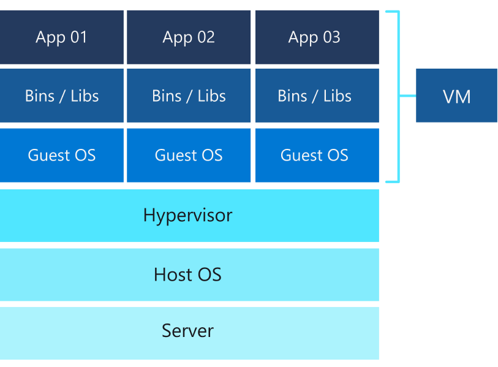

# What is a Virtual Machine?

A virtual machine (VM) is something practically identical to a normal computer. They both have a CPU, RAM, a hard drive, network interfaces, ... It is also possible to install operating systems and software on them. The difference is that a physical computer uses its own hardware, while a virtual machine borrows physical resources from its host. Therefore, a virtual machine is just code, a virtual computer inside a physical server.

The software called hypervisor (in this case VirtualBox) is responsible for creating and running virtual machines, as well as managing resources (such as CPU, memory, and storage) among them.

## Advantages of VMs
- Run a different operating system than the physical computer without having to partition your hard drive or reboot it.
- Install old operating systems, even if the hardware is no longer supported.
- Carry an entire operating system on a USB, or transfer an entire machine from one computer to another easily.
- Develop a program designed for a different operating system than the physical machine.
- As a VM provides an environment isolated from the rest of the system, it is possible to run malicious software without risk to the physical computer. Also, it is possible to take a snapshot of the state of the VM to restore it as it was at that moment.
- A virtual machine (and its hard drives) can be easily frozen, rebooted, copied, transferred from one computer to another, and deleted.
- It is highly scalable, since it allows you to install several virtual machines on a limited number of physical computers, instead of having to multiply the number of physical machines. This saves on costs, electricity and maintenance time.

## Ddisadvantages of VMs
- The host computer must be able to handle virtualization: too little RAM leads to slowness and latency.
- If the host computer breaks down, the virtual machines might no longer be accessible unless there are backups on another physical machine.
- A physical computer is also more vulnerable to attacks if it runs several virtual machines rather than a single operating system.
