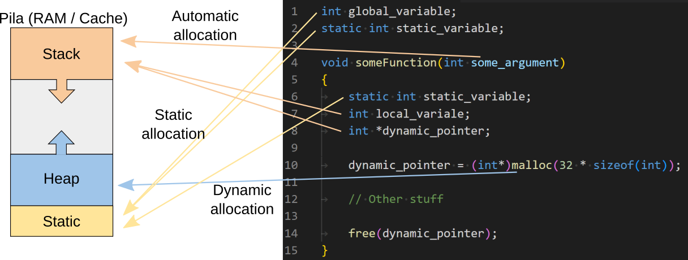

# Get Next Line (gnl) : Leer una línea de un fd es tedioso
***Oficialmente terminado el 22/09/2022 / Nota 125 de 100 / [English](README.md) version***

El objetivo de este proyecto es programar una función que devuelva una línea leída de un file descriptor sin perder la pista de la siguiente línea y con un tamaño de búfer aleatorio.

## Requisitos del ejercicio
- La forma de leer el contenido de un archivo debe ser extrayendo una línea en cada ejecución del programa con sucesivas llamadas a este.
- Debe devolver el contenido de la línea leída seguido del carácter de salto de línea ('\n'), a menos que se esté al final del archivo y no termine con salto de línea
- Debe devolver NULL cuando no haya nada que leer o en caso de error
- (Bonus) Debe leer desde un archivo o desde la entrada estándar
- (Bonus) El programa solo puede tener una única variable estática

## Conceptos básicos a interiorizar en esta práctica
### Variables estáticas
Una variable local en el momento en que acaba la subrutina/función en la que se haya declarado se eliminan las referencias de la pila y se quitan de la memoria.
Por otro lado, una variable estática persiste hasta el final del programa, independientemente de donde se haya declarado (son equiparables a las variables globales, aunque con matices).



> NOTA: Los array en C se guardan en Stack, no en Heap. Aunque sean equivalentes a un puntero + malloc.

Aquí un ejemplo de como una variable estática local no pierde su memoria sin importar cuántas veces se llame a la función en la que ha sido declarada:

```c
#include <stdio.h>

void foo(void)
{
	static int	x; // Declaración de la variable estática
	// NOTA: Su valor por defecto es 0

	printf("x = %d", x);
	x++;
}
int main(void)
{
	int count;

	count = 0;
	while (count <= 10)
	{
		foo();
		count++;
	}
	return (0);
}
//	Aquí, una vez finaliza el programa, es cuando la variable estática deja de "existir"
```

Output:
```c
x = 0
x = 1
x = 2
x = 3
x = 4
x = 5
x = 6
x = 7
x = 8
x = 9
x = 10
```

De cara a la práctica get next line, una vez se cargan los caracteres leídos del búfer a la variable estática y se ve que no hay un salto de línea (`\n`) y además no se ha finalizado la lectura del archivo, hay que seguir guardando en esta variable las cosas leídas desde `read` hasta encontrar un `\n`. Para luego, sacar los caracteres anteriores al salto de línea y seguir guardando el resto en la variable estática.

### Descriptor de archivo (*File Descriptors (fd)*) + abrir y cerrar un archivo
Para manipular un archivo en C tienes que decirle al sistema operativo de donde le va a venir la información que hay en el archivo, aquí es donde entra el descriptor de archivo. En los sistemas operativos basados en Unix, el descriptor de archivo es un identificador único para un archivo u otro recurso de entrada/salida.

Existen tres descriptores estándar, cada uno relacionado con los tres flujos de datos estándar:

| Valor entero |      Nombre      | Constante simbólica  | Secuencia de archivos |
|:------------:|:----------------:|:--------------------:|:---------------------:|
|      0       | Entrada estándar |    STDIN_FILENO      |         stdin         |
|      1       | Salida estándar  |    STDOUT_FILENO     |         stdout        |
|      2       | Error estándar   |    STDERR_FILENO     |         stderr        |

Sabiendo esto, para poder abrir el archivo que quieres leer necesitarás usar la función `open` de la librería `fcntl.h`, su funcionamiento es el siguiente:

```c
// Propotipo:
int open(const char *direccion_archivo, int flags);

// Tipos de flags:
flags1 = open("archivo.txt", O_RDONLY); // solo lectura
flags2 = open("archivo.txt", O_WRONLY); // solo escritura
flags3 = open("archivo.txt", O_RDWR);   // lectura escritura
```

El valor devuelto es un descriptor de archivo siendo este una referencia a el archivo que se le ha pasado. Además, `open` puede devolver −1 indicando una falla con `errno` detallando el error.

Finalmente, cuando terminas de manipular el archivo, tienes que desreferenciar el descriptor del archivo con la función `close` de la biblioteca `unistd.h`.

Este es un ejemplo de cómo abrir y cerrar un archivo de forma correcta:

```c
#include <fcntl.h>
#include <unistd.h>

int	main(void)
{
	int	fd;

//	Abre el archivo y asigna el descriptor del archivo
//	devuelto a la variable fd para usarla más tarde:
	fd = open("fichier.txt", O_RDONLY);
//	Comprueba que se ha abierto correctamente:
	if (fd == -1)
		return (-1);

//	[...]

//	Por último cierra el archivo con la referencia de su fd:
	close(fd);
	return (0);
}
```

### Leer de un archivo
La función `read`, de la biblioteca `unistd.h`, carga el contenido de un archivo en la memoria, en parte o en su totalidad, utilizando un descriptor de archivo.

```c
ssize_t read(int fd, void *buf, size_t count);
             └─┬──┘  └───┬───┘  └─────┬────┘
               │         │            └─────> Número de caracteres a leer
               │         └─────> Puntero hacia un área de memoria donde almacenar temporalmente los caracteres que se leen
               └─────> Este es fd que se recibe del open
```

El resultado de `read` son los caracteres que ha leído, utilizando *-1* como aviso de algún error en la lectura.

**IMPORTANTE:** `read` deja de leer cuando llega al número de caracteres dado, o al final del archivo (EOF). Y recordará la posición del último carácter leído, por lo que si se vuelve a llamar más tarde con el mismo descriptor de archivo, reanudará la lectura donde la dejó, o se quedará al final del archivo si ya lo había terminado de leer.

En el caso del get next line, la *fd* es una de las variables que hay que pasarle a la función y *count* está definido por el valor de *BUFFER_SIZE* el cual hay que definir en el tiempo de compilación.

### Qué es un buffer + BUFFER_SIZE
En el caso del software, un búfer es un área de datos compartida por procesos de programa que funcionan a diferentes velocidades. El búfer permite que cada proceso funcione sin que el otro lo detenga. Al igual que un caché, un búfer es un "lugar de espera de punto medio", pero existe no tanto para acelerar la velocidad de una actividad como para apoyar la coordinación de actividades separadas.

Hay que tener en cuenta que un búfer sea efectivo, se debe considerar el tamaño del búfer y los algoritmos para mover datos dentro y fuera del búfer.

Ejemplo de un búfer de 16 bytes funcionando:


En get next line se pide que el tamaño del buffer se defina en la variable `BUFFER_SIZE` a la hora de compilar (utilizando el flags `-D`) para poder cambiarlo de forma sencilla. Y para prevenirse por si el usuario no lo define a la hora de compilar, es recomendable establecer un valor por defecto en el header del get next line:

```c
# ifndef BUFFER_SIZE		// Si BUFFER_SIZE no está definido
#  define BUFFER_SIZE 64	// Dale un valor por defecto
# endif
```

NOTA: Dependiendo del tamaño del buffer a la hora de utilizar `read` es probable que te quedes corto y no encuentres un final de línea y tengas que guardar esa información del buffer y volver a ejecutar `read` hasta encontrar un salto de línea y en ese momento te pases y tengas que guardar los caracteres después del salto de línea en la variable estática, ya que cuando vuelvas a ejecutar `read` leerá desde donde se había quedado y el buffer se sobrescribirá de nuevo.


## Como he organizado las metas de este ejercicio
### [main](main.c) que abre y cierra un archivo de prueba para pasar al get_next_line
La función get_next_line no tienen que abrir o cerrar ningún archivo. Solo tiene que leer de un descriptor de archivo que recibe como parámetro.
Para abrir y cerrar un archivo se tiene que usar un script como el mostrado anteriormente.

### Función para leer de un descriptor de archivo
Dentro de [get_next_line.c](get_next_line.c) está la función `gnl_read` la cual tiene un bucle de lectura que se detiene cuando `read` devuelve 0, esto es se ha llegado al final del archivo y no queda nada más para leer. Y dentro del bucle hace lo siguiente:

  1. Leer del descriptor de archivo
  2. Si la lectura devuelve -1, significa que ha habido un error, y sale del bucle
  3. Añade los datos leídos del búfer a la variable estática
  5. Verifica que hay un salto de línea, para saber si ya se ha leído una línea entera, y si es así detiene el bucle.

### Sacar una línea de la variable estática y guardar los caracteres extra leídos
Dentro de [get_next_line.c](get_next_line.c) está la función `split_new_line` la cual solo la llamada si se sabe con certeza que hay un salto de línea en la variable estática o que no queda nada para leer en el archivo. Y lo que se hace en esta función es sacar los caracteres hasta el salto de línea (para obtener la línea) que hay que devolver en la función `get_next_line`:

  1. Se cuentan el número de caracteres hasta el salto de línea inclusive, si es que existe
  2. Hace un `malloc` de una cadena del tamaño contado (+ 1 para el \0 final)
  3. Copia los caracteres hasta el \n o el \0 y se agrega el \0 final

Si se ha llegado al final del archivo se devuelve la línea directamente. Si no, hay que reiniciar la variable estática guardando solo los caracteres después del salto de línea:

  1. Copia la variable estática en una variable auxiliar
  2. Mide el tamaño del string en la variable estática, menos el número de caracteres hasta el salto de línea (este incluido) (+ 1 para el \0 final)
  3. Se rescala la variable estática con este nuevo tamaño
  4. Y se copian los datos de la variable auxiliar desde en salto de línea hasta el final
  5. Devuelve la línea

### Juntar todo en la función get_next_line
Desde la función [`get_next_line`](get_next_line.c) se:

- Declara la variable estática
- Se verifica que el fd y el BUFFER_SIZE son correctos
- Coordinan las demás funciones
  - Llamar a la función de lectura
  - Si se ha leído algo, se saca una línea de la variable estática
  - Si en próximas llamadas a `get_next_line` ya no se ha leído nada, pero la variable estática no es nula o no está vacía, se vuelve a sacar una línea de la variable estática
 - Si la línea a devolver es nula o está vacía, se libera cualquier memoria asignada y se apunta a NULL,
 - Se devuelve el valor de la línea

### (Bonus) Leer de más de un *fd*
Teniendo en cuenta que una parte del bonus es **usar una única variable estática**, cosa bastante fácil de hacer, ya que para guardar el valor durante la vida útil del programa de los caracteres sobrantes leídos después de un salto de línea, solo es necesario usar una variable.

En cambio, la segunda parte del bonus pide que se **instancie muchas veces la función get_next_line, para leer desde múltiples descriptores** de archivos sin mezclarlos. Para ello, solo hay que modificar el gnl base y transformar la variable estática en una matriz de cadenas, una para cada fd. Ver [get_next_line_bonus](get_next_line_bonus.c).

>NOTA: Dependiendo del sistema operativo, existe un límite en la cantidad de archivos que se pueden abrir simultáneamente, lo ideal es usar ese valor para definir el tamaño de la matriz. Aunque para esta práctica con poner un límite de 1024 fd abiertos simultáneamente debería ser más que suficiente para pasar los tests y la moulinette.

## Solución de problemas típicos
### La definición del búfer y su tamaño: **Stack Overflow**
#### ¿Qué es el Stack Overflow?
Para comprender este error primero es necesario saber que la memoria *stack* está limitada según el lenguaje/compilador que se esté usando, aunque en varios lenguajes/compiladores se puede establecer el tamaño solicitado.

Por lo general, los valores predeterminados (si no se configuran manualmente) son de aproximadamente 1 MB para los idiomas actuales, lo cual es suficiente a menos que haga algo que generalmente no se recomienda (como asignar matrices enormes en el stack).

Sabiendo esto ya se puede intuir que este error ocurre cuando se rebasa el límite establecido en el stack.

Una de las soluciones, si es posible, es utilizar la memoria heap en su lugar la cual tiene un límite mucho mayor (dependiendo de la RAM que tenga el PC).

#### Dos formas de declarar el búfer: Array VS malloc()
<table>
    <thead>
        <tr>
            <th>Forma de Array (se guarda en el stack)</th>
            <th>Con Malloc (se guarda en el heap)</th>
        </tr>
    </thead>
    <tbody>
        <tr>
            <td><pre lang="c">
char	buffer[BUFFER_SIZE + 1];
<br>
reader = read(fd, buffer, BUFFER_SIZE);</pre></td>
            <td><pre lang="c">
char	*buffer;
<br>
buffer = malloc((BUFFER_SIZE + 1) * sizeof(*buffer));
if (!buffer)
	return (NULL);
reader = read(fd, buffer, BUFFER_SIZE);
<br>
/* [some code] */
<br>
free(buffer);</pre></td>
        </tr>
        <tr>
        	<td>Aunque esta forma es mucho más sencilla, pero dado que el stack está limitado (y la idea de esta práctica no es modificar ese limite) la única opción viable es limitar el tamaño máximo del búfer a un valor que el stack pueda manejar introduciendo el siguiente código en el header.
			<pre lang="c">
# if BUFFER_SIZE > 8000000		// Si el tamaño del búfer es muy grande
#  undef BUFFER_SIZE			// se borra dicho valor
#  define BUFFER_SIZE 8000000	// y se redimensiona a algo manejable
# endif</pre></td>
        	<td>Esta otra opción, la cual yo recomiendo, aunque un poco más compleja evita que se tenga que limitar el tamaño del buffer y así hacer la prática de la forma más ortodoxa posible.</td>
        </tr>
    </tbody>
</table>

#### ¿Y si no se define el BUFFER_SIZE al compilar?
Una forma de proteger el programa si a la hora de la compilación no se define el valor del BUFFER_SIZE, puede ser introducir en el [header](get_next_line.h) el siguiente código para definir un valor por defecto:

```c
# ifndef BUFFER_SIZE        // Si el BUFFER_SIZE no está definido
#  define BUFFER_SIZE 64    // se le da uno por defecto
# endif
```

### Mala liberalización / gestión de memoria
Como ya puedes intuir por el enunciado de la práctica, es probable es que en esta práctica se tenga que liberar alguna variable dentro de un bucle, o sin saber si la variable que se desea liberar esta *mallocada* o no. Esto puede derivar errores típicos como liberaciones dobles, liberaciones fallidas o intentos de liberaciones de cadenas no asignadas. En este sentido las mejores herramientas para combatir esta problemática son el flag de compilación `-fsanitize=address` y `Valgrind`. Aunque dependiendo del sistema operativo en el que estes estas dos herramientas tienen más o menos prestaciones:

| SO        | -fsanitize=address                                                           | Valgrind                                                   |
|-----------|------------------------------------------------------------------------------|------------------------------------------------------------|
| GNU/Linux | Detectar donde se producen `segmentation fault`, así como errores de memoria | Para nuestro nivel hace más o menos lo mismo que -fanitize |
| MacOS     | Detectar donde se producen `segmentation fault`                              | Detecta errores de memoria                                 |
|

> Algunos tipos de errores de memoria:
>- `detected memory leaks`: La no liberalización de memoria (`free()`)
>- `heap-use-after-free`: Usar una variable después de ser liberada sin tener memoria asignada
>- `stack-buffer-overflow`, `heap-buffer-overflow`, o `global-buffer-overflow`: Cuando se ha reservado más memoria de la disponible

Una forma de evitar el error **double-free** es que cuando se quiere volver a usar una variable de memoria ya liberada, antes de volver a hacer un malloc para reservarle memoria hacer que apunte a `NULL`. Esto puede ser especialmente útil con variables globales o estáticas.

```c
#define SIZE 0

void	foo(void)
{
	static char	*mem;

	mem = malloc ((SIZE + 1) * sizeof(*mem));
	if (!mem)
		return (NULL);

	/* código */

	free(*mem);
	*mem = NULL;

	/* más código */

	mem = malloc ((SIZE + 1) * sizeof(*mem));
	if (!mem)
		return (NULL);
}
```

---
Hecho por daampuru | LinkedIn: [David Ampurua](https://www.linkedin.com/in/david-ampurua)
