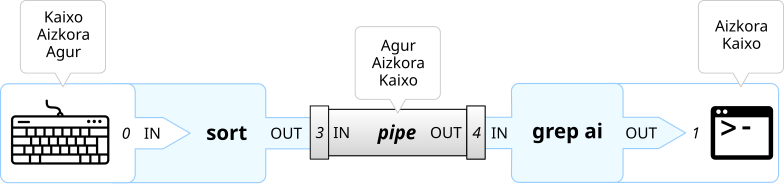
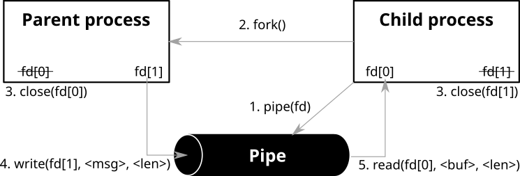
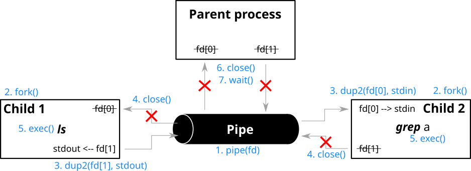

# Pipex
***Oficialmente terminado el 15/06/2023 / Nota 125 de 100 / [English](README.md) version***

Este proyecto trata sobre el manejo de pipes. Este proyecto te permitirá descubrir, mediante el uso en tu programa, el funcionamiento de un mecanismo de UNIX que ya conoces.

> “This is the Unix philosophy:
>
> Write programs that do one thing and do it well.
>
> Write programs to work together.
>
> Write programs to handle text streams, because that is a universal interface.”
>
> -- <cite>Douglas McIlroy, the inventor of the Unix pipe</cite>


## Índice
- [Pipex](#pipex)
	- [Índice](#índice)
	- [Enunciado del ejercicio](#enunciado-del-ejercicio)
		- [Bonus](#bonus)
	- [Conceptos básicos a interiorizar en esta práctica](#conceptos-básicos-a-interiorizar-en-esta-práctica)
		- [1. Las pipes y fork](#1-las-pipes-y-fork)
			- [1.1. Pipe](#11-pipe)
			- [1.2. Fork](#12-fork)
			- [1.3. Ejemplo de aplicación con pipe() y fork(): Comunicación entre el proceso padre e hijo](#13-ejemplo-de-aplicación-con-pipe-y-fork-comunicación-entre-el-proceso-padre-e-hijo)
			- [1.4. Otras funciones de utilidad](#14-otras-funciones-de-utilidad)
		- [2. Redirecciones (Para el bonus)](#2-redirecciones-para-el-bonus)
			- [2.1. Redirecciones en C](#21-redirecciones-en-c)
			- [2.2. dup() y dup2()](#22-dup-y-dup2)
		- [3. execve: Ejecuta un programa](#3-execve-ejecuta-un-programa)
		- [4. access()](#4-access)
	- [Referencias](#referencias)


## Enunciado del ejercicio
En programa será ejecutado de la siguiente manera: `./pipex file1 cmd1 cmd2 file2`. El cual debe ser equivalente a este comando de shell `< file cmd1 | cmd2 > file2`.

Donde,
  - `file1` y `file2` son nombres de ficheros
  - `cmd1` y `cmd2` son comandos de shell con sus parámetros

> La gestión de errores debe ser como el comando equivalente de shell.

Ejemplo de comando de entrada:

`< infile ls -l | wc -l > outfile` ---> `./pipex infile "ls -l" "wc -l" outfile`

### Bonus
  - Gesniona multiples pipes:
    - Formato en C; `./pipex file1 cmd1 cmd2 cmd3 ... cmdn file2`
    - Equivalente en shell; `< file1 cmd1 | cmd2 | cmd3 ... | cmdn > file2`
  - Implementa '`<<`' y '`>>`' cuando el primer parámetro sea un *here_doc*:
    - Formato en C; `./pipex here_doc LIMITER cmd cmd1 file`
    - Equivalente en shell; `cmd << LIMITER | cmd1 >> file`


## Conceptos básicos a interiorizar en esta práctica
Una de las cosas básicas que tienes que saber y yo no me voy a detener a explicar son los *file descriptors* (`fd`) y las funciones para gestionar archivos (como `open()` o `read()`), ya tienes que saber lo elemental gracias al [get_next_line](../../lvl1/get_next_line/LEEME.md). También es recomendable saber lo básico sobre [como se gestionan los procesos en un sistema UNIX](annex/theory/PID.es.md), para irse familiarizando se con la terminología.


### 1. Las pipes y fork
#### 1.1. Pipe
```c
// Prototype
int pipe(int fd[2]);

// Return:
// -1 => Fallo
//  0 => Ejecución correcta
```

>NOTA: En la terminal la función pipe se representa con el simbolo '`|`'.

Las pipes (tubería, en español) sirven para comunicar procesos entre ellos, estableciendo una cadena de pipes (llamada *pipeline*) entre la salida de uno y la entrada del siguiente.

Son datos/transmisiones almacenadas en un búfer, que está asociado con dos file descriptors que están configurados para que el primero pueda leer los datos que se escriben en el segundo.

Características básicas de una pipe:
  - Comunicación **unidireccional**. Para hacerla birireccional usa 2 pipes una para cada dirección.
  - Sí la pipe es creada por el proceso padre antes de hacer un `fork()` y crear al **proceso hijo**, este también **puede utilizarla**.
  - Si un **proceso intenta leer estando la pipe vacía**, el proceso **se suspende** hasta que se escriba algo en ella.
  - La función `pipe()` **encuentra las 2 primeras posiciones disponibles de la tabla de file descriptors del proceso** y asigna uno para el extremo de entra/lectura y otro para el de salida/escritura de la pipe.

Ejemplo del uso de una pipe en bash:
```shell
sort | grep ai
```


El programa `sort` lee por su *stdin* (0) una serie de palabras que ordena y escribe en su file descriptor (3) de salida proporcionado por la `pipe()`. Esta a su vez transmite esa información al file descriptor de lectura (4) de lectura de `grep`, el cual trata los datos para después escribirlos en su *stdout* (1).


#### 1.2. Fork
```c
// Prototype
pid_t fork(void);

// Return:
// <0 -> Fallo
// =0 -> (Al proceso hijo) Éxito
// >0 -> (Al proceso padre) Éxito. Devuelva el PID del proceso hijo creado
```

En los sistemas operativos basados en Unix, los nuevos procesos son creados por la llamada al sistema `fork()`. El PID del proceso hijo creado se devuelve al proceso padre, lo que le permite referirse al hijo en futuras llamadas a funciones. El padre puede, esperar a que el hijo termine con la función `waitpid()`, o terminar el proceso con `kill()`.

<table>
<thead>
  <tr>
    <th>2 procesos que ejecutan el mismo programa después del `fork()` instrucción</th>
    <th>2 procesos dicen su propio PID</th>
  </tr>
</thead>
<tbody>
  <tr>
    <td><pre lang="c">
#include &ltstdio.h&gt
#include &ltunistd.h&gt
int main()
{
	fork();
	printf("Hello world!\n");
	return (0);
}</pre></td>
    <td><pre lang="c">
#include &ltstdio.h&gt
#include &ltunistd.h&gt
int main()
{
	pid = fork();
	// Este es el proceso hijo ya que el return del fork es igual a 0
	if (pid == 0)
	{
		printf("Hello from Child! My PID is %i\n", (int)getpid());
	}
	// Este es el padre ya que el return del fork es positivo
	else
		printf("Hello from Parent! My PID is %i, I also know child PID = %i\n", \
		(int)getpid(), pid);
	return (0);
}</pre>
    </td>
  </tr>
  <tr>
    <td>Output:<br>
    <pre>
Hello world!
Hello world!</pre>
    </td>
    <td>Output:<br>
    <pre>
Hello from Parent! My PID is 155, I also know child PID = 156
Hello from Child! My PID is 156</pre>
    </td>
  </tr>
</tbody>
</table>

>NOTA: Ten cuidado a la hora de usar funciones con buffer como `printf`, la cual mete en un buffer el texto hasta levar a un salto de línea `\n`. A la hora de hacer el fork copia el proceso padre tal y como está y esto incluye entre otras cosas el buffer de salida.
>
>Aquí te dejo unos casos donde el buffer ha causado problemas:
>  - https://stackoverflow.com/questions/20252964/fork-and-n
>  - https://unix.stackexchange.com/questions/447898/why-does-a-program-with-fork-sometimes-print-its-output-multiple-times

#### 1.3. Ejemplo de aplicación con pipe() y fork(): Comunicación entre el proceso padre e hijo
Para este ejemplo se han creado 2 procesos, padre e hijo. El padre genera un string y se lo envía al hijo mediante la pipe y este lo lee y lo escribe en la terminal. Abajo se puede ver un esquema del proceso y el código de prueba.



```c
#include <stdlib.h>
#include <string.h>
#include <sys/wait.h>
#include <unistd.h>

int main()
{
	int fd[2];
	pid_t pid;

	// STEP 1: Create a pipe
	if (pipe(fd) == -1) {
		write(2, "Pipe Failed\n", 13);
		return (1);
	}

	// STEP 2: With fork() create a child process
	pid = fork();
	if (pid < 0) {
		write(2, "Fork Failed\n", 13);
		return (1);
	}

	// Inside Parent Process
	else if (pid > 0) {
		write(1, "(Parent) Running\n", 18);
		close(fd[0]); // STEP 3: Close reading end of the pipe

		// STEP 4: Write  string and close writing end of the pipe.
		write(fd[1], ">>Message from parent to the child<<\n", 38);
		close(fd[1]);

		write(1, "(Parent) Waiting for child to print a string\n", 46);
		wait(NULL);
		write(1, "(Parent) Finished\n", 19);
	}

	// Inside Child Process
	else {
		char str[100] = "(Child) Parent says: ";
		write(1, "(Child) Running\n", 17);
		close(fd[1]); // STEP 3: Close writing end of the pipe

		// STEP 4: Read a string using the pipe and close reading end
		char str_parent[100];
		read(fd[0], str_parent, 100);
		close(fd[0]);

		// Write concatenated string
		strcat(str, str_parent);
		write(1, str, strlen(str) + 1);
		write(1, "(Child) Finished\n", 18);
		exit(0);
	}
	return (0);
}
```

Output:
```
(Parent) Running
(Child) Running
(Parent) Waiting for child to print a string
(Child) Parent says: >>Message from parent to the child<<
(Parent) Finished
(Child) Finished
```

#### 1.4. Otras funciones de utilidad
<table>
<thead>
  <tr>
    <th>Función</th>
    <th>Protopito</th>
    <th>Descripción</th>
  </tr>
</thead>
<tbody>
  <tr>
    <td>wait</td>
    <td><code lang="c">pid_t wait(int *status);</code></td>
    <td>Suspende la ejecución del proceso padre hasta que finaliza uno de sus hijos.</td>
  </tr>
  <tr>
    <td>waitpid</td>
    <td><code lang="c">pid_t waitpid(pid_t pid, int *status, int options);</code></td>
    <td>Suspende la ejecución del proceso padre hasta que el proceso hijo especificado por el argumento <i>pid</i> haya cambiado de estado.</td>
  </tr>
  <tr>
    <td>exit</td>
    <td><code lang="c">void exit(int status);</code></td>
    <td>La función provoca la terminación normal del proceso. El byte de estado menos significativo se devuelve al padre (mediante <code lang="c">wait()</code> 😉).</td>
  </tr>
</tbody>
</table>


### 2. Redirecciones (Para el bonus)
Las redirecciones permiten utilizar como fuente de entrada archivos existentes y/o enviar la salida a un archivo además a parte de archivos también se pueden usar files descriptors. De este modo no se depende únicamente del input del teclado o utilizar como output la terminal. Para hacer estar redirecciones en bash se usan los siguientes símbolos:

<table>
<thead>
  <tr>
    <th>Redirección<br></th>
    <th>Nombre<br></th>
    <th>Comando de ejemplo<br></th>
    <th>Descripción<br></th>
  </tr>
</thead>
<tbody>
  <tr>
    <td><code><</code></td>
    <td>Redirecciona el input</td>
    <td><code>[n]&lt;word</code></td>
    <td>Lee el archivo word en el fd n<br></td>
  </tr>
  <tr>
    <td><code>></code></td>
    <td>Redirecciona el output</td>
    <td><code>[n]&gt;[|]word</td>
    <td>Escribe en el archivo word lo que este en el fd n. Sí en archivo no existe se crea</td>
  </tr>
  <tr>
    <td><code><<</code></td>
    <td>Here Documents</td>
    <td><code>[n]&lt;&lt;[-]word<br></t>here-document<br>delimiter<code></td>
    <td>Le indica al shell que lea la entrada de la fuente actual hasta que se vea<br>
    una línea que tenga solo una palabra (sin espacios al final).<br>
    Las líneas leídas hasta ese punto se utilizan como entrada estándar.</td>
  </tr>
  <tr>
    <td><code>>></code></td>
    <td>Agrega la salida redireccionada</td>
    <td><code>[n]&gt;&gt;word</code></td>
    <td>Añade lo leído en el fd n al archivo word.</td>
  </tr>
  <tr>
    <td><code><<<</code></td>
    <td>Here Strings</td>
    <td><code>[n]&lt;&lt;&lt; 'string to read'</code></td>
    <td>Escribe el String en el fd n.</td>
  </tr>
</tbody>
</table>

> NOTA: Si el primer carácter de la redirección es `<`, la redirección usa el *sdtin*. En cambio, si es `>`, la redirección hace referencia al *stdout*.
> *Lo que está entre "[]" son argumentos opcionales

#### 2.1. Redirecciones en C

Hay muchas formas de hacer redirecciones en C, pero debido a las restricciones que pone el ejercicio, es necesario conocer las funciones `dup()` y/o `dup2()`. Y recomendable saber la función `execve()`. Más abajo tienes 2 apartados explicándolas.

El código de ejemplo de abajo, hace una redirección y ejecuta un comando:
```c
#include <stdio.h>
#include <unistd.h>
#include <fcntl.h>

int main(int argc, char *argv[])
{
	int		fd;
	char	*command[] = {"/usr/bin/sort", NULL};
	char	*input_file = argv[0];
	if (fd = open(input_file, O_RDONLY, S_IWUSR | S_IRUSR) < 0)
	{
		perror("Error open()");
		return (1);
	}
	if (dup2(fd, 0) < 0)
	{
		perror("Error dup2()");
		return (1);
	}
	if (execv(command[0], command) < 0)
	{
		perror("Error execv()");
		return (1);
	}
	return (0);
}
```
Si se le hace un fork-and-exec, el proceso hijo aún tendrá su salida redirigida a un archivo (incluso después del exec).

Aquí te pongo otro ejemplo más trabajado para verlo mejor, el algoritmo coje como argumento el filtro que le quieras poner a la salida de `ls` (es el equivalente a hacer el comando de terminal `ls | <el filtro que quieras>`). Por ejemplo, si haces `gcc main.c && ./a.out grep a` equivale a `ls | grep a`. Para ello, el proceso padre crea 2 hijos; uno para ejecutar el comando `ls` y pasar su output al segundo, para que este segundo hijo ejecute el *filtro* que le has pasado a la función.



```c
#include <stdio.h>
#include <stdlib.h>
#include <unistd.h>
#include <sys/wait.h>

int main (int argc, char *argv[]) {
	int i, fd[2], pid[2];

	/* Argument check */
	if (argc < 2) {
		fprintf(stderr, "Uso: %s filtro\n", argv[0]);
		exit(1);
	}

	pipe(fd); // pipe creation

	/* Child 1 exec "ls" */
	pid[0]= fork();
	if (pid[0] == 0) {
		dup2(fd[1], 1); // NOTE: 1 -> STDOUT_FILENO = fileno(stdout)
		close(fd[0]);
		close(fd[1]);
		execlp("/bin/ls", "ls", NULL);
		perror("Child 1 : Fail making exec");
		exit (1);
	}
	/* Child 2 exec the filter */
	pid[1]= fork();
	if (pid[1] == 0) {
		dup2(fd[0], 0); // NOTE: 0 -> STDIN_FILENO = fileno(stdin)
		close(fd[0]);
		close(fd[1]);
		execvp(argv[1], &argv[1]);
		perror("Child 2 : Fail making exec");
		exit (1);
	}
	/* The parent does nothing */
	close(fd[0]);
	close(fd[1]);
	for (i=0; i<2; i++)
		waitpid(pid[i], NULL, 0);
	return (0);
}
```


#### 2.2. dup() y dup2()
```c
// Prototype
int dup(int oldfd);
int dup2(int oldfd, int newfd);

// Return:
// Fallo -> -1
// Éxito -> El valor del fd que se ha utilizado para copiar oldfd
```
`dup()` usa un nuevo file descriptor para referenciar\* el file descriptor abierto en *oldfd*. La diferencia entre `dup()` y `dup2()` reside en que con `dup2()` puedes elegir en file descriptor donde se va a copiar *oldfd* con el argumento *newfd*\*\*, mientras que `dup()` usará el menor file descriptor que haya libre.

> \*¡OJO! que no es lo mismo que copiar, al referenciar en nuevo file descriptor queda atado al primero, si el primero cambia el nuevo también. Aunque por comodidad a partir de ahora diré copiar.
>
> \*\*Si el file descriptor seleccionado en *newfd* estaba abierto de antemano se cerrará y se volverá ha abrir.

En este ejemplo veras como al abrir en archivo "dup.txt" y copiar el fd dado por open se pueden usar los dos fd indistintamente.
```c
#include <unistd.h>
#include <fcntl.h>

int main()
{
	// open() returns a file descriptor to the file "dup.txt"
	int original_fd = open("dup.txt", O_WRONLY | O_APPEND);
	if(original_fd < 0)
		write(2,"Error opening the file\n", 24);

	// dup() create "copy" of original_fd on copy_fd. Now both can be used interchangeably.
	int copy_fd = dup(original_fd);

	// write() will write the given string into the file referred by the file descriptors
	write(original_fd,"(Original) This will be output to the file named dup.txt\n", 58);
	write(copy_fd,"(Copied) This will also be output to the file named dup.txt\n", 61);
	return (0);
}
```


### 3. execve: Ejecuta un programa
```c
// Prototype
int execve(const char *pathname, char *const argv[], char *const envp[]);

// Return:
// -1   -> Fallo (ver en errno)
// NULL -> Exito
```

`execve()` ejecuta el programa al que hace referencia *pathname*.

`execve()` reemplaza al proceso que lo ha llamado, por lo que si todo funciona correctamente y `execve()` finaliza el programa que se le ha dicho correctamente, también se finaliza el programa que invocó a `execve()`.

> `execve()` se basa en la familia de funciones **exec** la cual sirve para reemplazar en proceso actual por otro nuevo proceso. Las letras del prefijo indican lo siguiente:
>   - l – Utiliza la variable `const char *arg` para pasar los argumentos de la línea de comandos a la función en forma de lista (arg0, arg1, ..., argn). Es una función variadrica.
>   - v – En contraste con las funciones 'l', las funciones 'v'  especifican los argumentos de la línea de comandos del programa ejecutado como `char *const argv[]`. Por convención el primer argumento (arg0) es el propio nombre del ejecutable.
>   - e – El entorno de la nueva imagen del proceso se especifica mediante el argumento *envp*.
>   - p – Gracias a la variable de entorno *PATH* encuentra el archivo nombrado en el argumento del archivo que se va a ejecutar.

Ejemplo de cómo hacer el comando de shell `sort < file_with_lines.txt` en C:
```c
#include <stdio.h>
#include <unistd.h>

int main(int argc, char *argv[])
{
	char	*command[] = {"/usr/bin/sort", NULL};
	if (execv(command[0], command) < 0)
	{
		perror("Error execv()");
		return (1);
	}
	return (0);
}
```
Compilando el código de arriba `gcc main.c` y ejecutando el programa resultante de este modo; `./a.out < file_with_lines.txt` se consigue el mismo resultado.


### 4. access()
```c
// Prototype
int access(const char *pathname, int mode);

// Return:
// -1 -> Fallo
//  0 -> Exito
```
En los sistemas POSIX el comando `access()` se usa para verificar si el programa que llama tiene acceso a un archivo específico. En este caso es MUY útil para comprobar si un archivo y/o un comando existe.

Modos:
  - F_OK : Se utiliza para verificar la existencia del archivo.
  - R_OK : Se utiliza para verificar el bit de permiso de lectura.
  - W_OK : Se utiliza para verificar el bit de permiso de escritura.
  - X_OK : Se utiliza para verificar el bit de permiso de ejecución.


## Referencias
  - https://www.rozmichelle.com/pipes-forks-dups/
  - https://www.geeksforgeeks.org/c-program-demonstrate-fork-and-pipe/
  - https://www.geeksforgeeks.org/pipe-system-call/
  - https://www.geeksforgeeks.org/fork-system-call/
  - https://www.gnu.org/software/bash/manual/html_node/Redirections.html
  - https://tldp.org/LDP/abs/html/index.html
  - https://www.infor.uva.es/~fdiaz/aso/2004_05/doc/ASO_PR04_20041129.pdf
  - https://www.man7.org/linux/man-pages/man2/dup.2.html
  - https://www.geeksforgeeks.org/dup-dup2-linux-system-call/
  - https://www.cs.utexas.edu/~theksong/posts/2020-08-30-using-dup2-to-redirect-output/
  - https://stackoverflow.com/questions/2423628/whats-the-difference-between-a-file-descriptor-and-a-file-pointer
  - https://www.geeksforgeeks.org/access-command-in-linux-with-examples/
  - https://stackoverflow.com/questions/597311/why-does-the-child-process-here-not-print-anything
  - [[Youtube video list] Programming with Processes](https://www.youtube.com/playlist?list=PL9IEJIKnBJjFNNfpY6fHjVzAwtgRYjhPw)

---
Hecho por daampuru | LinkedIn: [David Ampurua](https://www.linkedin.com/in/david-ampurua)
