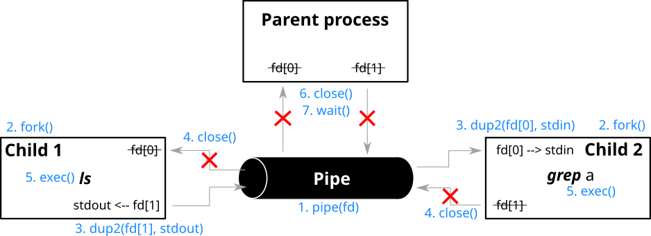

# Pipex
***Officially finished at 2023-06-15 / Grade: 125 of 100 / Versión en [español](LEEME.md)***

This project is about handling pipes. This project will allow you to discover, through the use in your program, the functioning of a UNIX mechanism that you already know.

> “This is the Unix philosophy:
>
> Write programs that do one thing and do it well.
>
> Write programs to work together.
>
> Write programs to handle text streams, because that is a universal interface.”
>
> -- <cite>Douglas McIlroy, the inventor of the Unix pipe</cite>


## Table of contents
- [Pipex](#pipex)
	- [Table of contents](#table-of-contents)
	- [Exercise statement](#exercise-statement)
		- [Bonus](#bonus)
	- [Basic concepts to know in this practice](#basic-concepts-to-know-in-this-practice)
		- [1. Pipes and forks](#1-pipes-and-forks)
			- [1.1. Pipe](#11-pipe)
			- [1.2. Fork](#12-fork)
			- [1.3. Example application with pipe() and fork(): Communication between parent and child process](#13-example-application-with-pipe-and-fork-communication-between-parent-and-child-process)
			- [1.4. Other useful functions](#14-other-useful-functions)
		- [2. Redirects (For the bonus)](#2-redirects-for-the-bonus)
			- [2.1. Redirections in C](#21-redirections-in-c)
			- [2.2. dup() y dup2()](#22-dup-y-dup2)
		- [3. execve: run a program](#3-execve-run-a-program)
		- [4. access()](#4-access)
	- [References](#references)

## Exercise statement
The program will be executed as follows: `./pipex file1 cmd1 cmd2 file2`. Which should be equivalent to this shell command `< file cmd1 | cmd2 > file2`.

Where,
  - `file1` and `file2` are file names
  - `cmd1` and `cmd2` are shell commands with their parameters

> Error handling should be the equivalent to shell command.

Example input command:

`< infile ls -l | wc -l > outfile` ---> `./pipex infile "ls -l" "wc -l" outfile`

### Bonus
  - Manage multiple pipes:
    - C format; `./pipex file1 cmd1 cmd2 cmd3 ... cmdn file2`
    - Equivalent in shell; `< file1 cmd1 | cmd2 | cmd3 ... | cmdn > file2`
  - Implements '`<<`' and '`>>`' when the first parameter is a *here_doc*:
    - C format; `./pipex here_doc LIMITER cmd cmd1 file`.
    - Equivalent in shell; `cmd << LIMITER | cmd1 >> file`


## Basic concepts to know in this practice
One of the basic things you need to know and I'm not going to stop to explain are the *file descriptors* (`fd`) and the functions to manage files (like `open()` or `read()`), you already have to know the basics thanks to the [get_next_line](../../lvl1/get_next_line/LEEME.md). It is also advisable to know the basics about [how processes are managed on a UNIX system](annex/theory/PID.es.md), to get familiar with the terminology.


### 1. Pipes and forks
#### 1.1. Pipe
```c
// Prototype
int pipe(int fd[2]);

// Return:
// -1 => Fail
//  0 => Correct execution
```

>NOTE: In the terminal, the pipe function is represented by the symbol '`|`'.

Pipes are used to communicate between processes by establishing a pipe chain (called a *pipeline*) between the output of one and the input of the next.

They are data/transmissions stored in a buffer, which is associated with two file descriptors that are configured so that the first one can read the data written in the second one.


Basic characteristics of a pipe:
  - **One-way** communication. To make it bi-directional uses 2 pipes, one for each direction.
  - If the pipe is created by the parent process before doing a `fork()` and creating the **child process**, the child **can also use it**.
  - If a **process attempts to read while the pipe is empty**, the process **suspends** until something is written to it.
  - The `pipe()` function **finds the first 2 available positions in the process's file descriptor table** and assigns one to the in/read end and one to the exit/write end of the pipe.

Example of using a pipe in bash:
```shell
sort | grep ai
```


The `sort` program reads through its *stdin* (0) a series of words which it sorts and writes to its file descriptor (3) output provided by the `pipe()`. This in turn transmits that information to the `grep` read file descriptor (4), which processes the data and then writes it to its *stdout* (1).

#### 1.2. Fork
```c
// Prototype
pid_t fork(void);

// Return:
// <0 -> Failure
// =0 -> (To child process) Success
// >0 -> (To parent process) Success. Return the PID of the created child process
```

On Unix-based operating systems, new processes are created by the `fork()` system call. The PID of the created child process is returned to the parent process, allowing it to refer to the child in future function calls. The parent can either wait for the child to terminate with the `waitpid()` function, or terminate the process with `kill()`.

<table>
<thead>
  <tr>
	<th>2 processes running the same program after the `fork()` instruction</th>.
    <th>2 processes say their own PID</th>.
  </tr>
</thead>
<tbody>
  <tr>
    <td><pre lang="c">
#include &ltstdio.h&gt
#include &ltunistd.h&gt
int main()
{
	fork();
	printf("Hello world!\n");
	return (0);
}</pre></td>
    <td><pre lang="c">
#include &ltstdio.h&gt
#include &ltunistd.h&gt
int main()
{
	pid = fork();
	// Este es el proceso hijo ya que el return del fork es igual a 0
	if (pid == 0)
	{
		printf("Hello from Child! My PID is %i\n", (int)getpid());
	}
	// Este es el padre ya que el return del fork es positivo
	else
		printf("Hello from Parent! My PID is %i, I also know child PID = %i\n", \
		(int)getpid(), pid);
	return (0);
}</pre>
    </td>
  </tr>
  <tr>
    <td>Output:<br>
    <pre>
Hello world!
Hello world!</pre>
    </td>
    <td>Output:<br>
    <pre>
Hello from Parent! My PID is 155, I also know child PID = 156
Hello from Child! My PID is 156</pre>
    </td>
  </tr>
</tbody>
</table>

>NOTE: Be careful when using buffered functions such as `printf`, which buffers the text until it leads to a line break `\n`. When forking, the parent process is copied as-is and this includes among other things the output buffer.
>
>Here are some cases where the buffer has caused problems:
>  - https://stackoverflow.com/questions/20252964/fork-and-n
>  - https://unix.stackexchange.com/questions/447898/why-does-a-program-with-fork-sometimes-print-its-output-multiple-times

#### 1.3. Example application with pipe() and fork(): Communication between parent and child process
For this example 2 processes have been created, parent and child. The parent generates a string and sends it to the child via the pipe, which reads it and writes it to the terminal. Below you can see a schematic of the process and the test code.


```c
#include <stdlib.h>
#include <string.h>
#include <sys/wait.h>
#include <unistd.h>

int main()
{
	int fd[2];
	pid_t pid;

	// STEP 1: Create a pipe
	if (pipe(fd) == -1) {
		write(2, "Pipe Failed\n", 13);
		return (1);
	}

	// STEP 2: With fork() create a child process
	pid = fork();
	if (pid < 0) {
		write(2, "Fork Failed\n", 13);
		return (1);
	}

	// Inside Parent Process
	else if (pid > 0) {
		write(1, "(Parent) Running\n", 18);
		close(fd[0]); // STEP 3: Close reading end of the pipe

		// STEP 4: Write  string and close writing end of the pipe.
		write(fd[1], ">>Message from parent to the child<<\n", 38);
		close(fd[1]);

		write(1, "(Parent) Waiting for child to print a string\n", 46);
		wait(NULL);
		write(1, "(Parent) Finished\n", 19);
	}

	// Inside Child Process
	else {
		char str[100] = "(Child) Parent says: ";
		write(1, "(Child) Running\n", 17);
		close(fd[1]); // STEP 3: Close writing end of the pipe

		// STEP 4: Read a string using the pipe and close reading end
		char str_parent[100];
		read(fd[0], str_parent, 100);
		close(fd[0]);

		// Write concatenated string
		strcat(str, str_parent);
		write(1, str, strlen(str) + 1);
		write(1, "(Child) Finished\n", 18);
		exit(0);
	}
	return (0);
}
```

Output:
```
(Parent) Running
(Child) Running
(Parent) Waiting for child to print a string
(Child) Parent says: >>Message from parent to the child<<
(Parent) Finished
(Child) Finished
```

#### 1.4. Other useful functions
<table>
<thead>
  <tr>
    <th>Function</th>
    <th>Protopite</th>
    <th>Description</th>
  </tr>
</thead>
<tbody>
  <tr>
    <td>wait</td>
    <td><code lang="c">pid_t wait(int *status);</code></td>
    <td>Suspende la ejecución del proceso padre hasta que finaliza uno de sus hijos.</td>
  </tr>
  <tr>
    <td>waitpid</td>
    <td><code lang="c">pid_t waitpid(pid_t pid, int *status, int options);</code></td>
    <td>Suspends execution of the parent process until the child process specified by the <i>pid</i> argument has changed state.</td>
  </tr>
  <tr>
    <td>exit</td>
    <td><code lang="c">void exit(int status);</code></td>
    <td>The function causes the normal termination of the process. The least significant byte of status is returned to the parent (via <code lang="c">wait()</code> 😉).</td>
  </tr>
</tbody>
</table>


### 2. Redirects (For the bonus)
Redirects allow you to use existing files as input source and/or send the output to a file. Besides files, you can also use file descriptors. This way you don't only rely on keyboard input or use the terminal as output. The following symbols are used to make these redirects in bash:

<table>
<thead>
  <tr>
    <th>Redirection<br></th>
    <th>Name<br></th>
    <th>Example command<br></th>
    <th>Description<br></th>
  </tr>
</thead>
<tbody>
  <tr>
    <td><code><</code></td>
    <td>Redirects the input</td>
    <td><code>[n]&lt;word</code></td>
    <td>Read the word file in the fd n<br></td>
  </tr>
  <tr>
    <td><code>></code></td>
    <td>Redirects the output</td>
    <td><code>[n]&gt;[|]word</td>
    <td>Write in the word file what is in the fd n. If the file does not exist, it is created.</td>
  </tr>
  <tr>
    <td><code><<</code></td>
    <td>Here Documents</td>
    <td><code>[n]&lt;&lt;[-]word<br></t>here-document<br>delimiter<code></td>
    <td>Tells the shell to read the current source entry until you see a line with only one word (no spaces at the end)<br>
	a line that has only one word (no spaces at the end).<br>
    Lines read up to that point are used as standard input.</td>
  </tr>
  <tr>
    <td><code>>></code></td>
    <td>Add the redirected output</td>
    <td><code>[n]&gt;&gt;word</code></td>
    <td>Add what you read in the fd n to the word file.</td>
  </tr>
  <tr>
    <td><code><<<</code></td>
    <td>Here Strings</td>
    <td><code>[n]&lt;&lt;&lt; 'string to read'</code></td>
    <td>Write the String in the fd n.</td>
  </tr>
</tbody>
</table>

> NOTE: If the first character of the redirect is `<`, the redirect uses the *sdtin*. Instead, if it is `>`, the redirect refers to *stdout*.
> *What is between "[]" are optional arguments

#### 2.1. Redirections in C
There are many ways to do redirects in C, but due to the restrictions of the exercise, it is necessary to know the `dup()` and/or `dup2()` functions. And it is advisable to know the `execve()` function. Below you have 2 sections explaining them.

Example code below, it does a redirect and executes a command:
```c
#include <stdio.h>
#include <unistd.h>
#include <fcntl.h>

int main(int argc, char *argv[])
{
	int		fd;
	char	*command[] = {"/usr/bin/sort", NULL};
	char	*input_file = argv[0];
	if (fd = open(input_file, O_RDONLY, S_IWUSR | S_IRUSR) < 0)
	{
		perror("Error open()");
		return (1);
	}
	if (dup2(fd, 0) < 0)
	{
		perror("Error dup2()");
		return (1);
	}
	if (execv(command[0], command) < 0)
	{
		perror("Error execv()");
		return (1);
	}
	return (0);
}
```

If it is fork-and-execed, the child process will still have its output redirected to a file (even after the exec).

Here I give you another more worked example to see it better, the algorithm takes as argument the filter that you want to put on the output of `ls` (it is the equivalent of doing the terminal command `ls | <the filter that you want>`) . For example, doing `gcc main.c && ./a.out grep a` is equivalent to `ls | grep a`. To do this, the parent process creates 2 children; one to execute the `ls` command and pass its output to the second, so that this second child executes the *filter* you passed to the function.



```c
#include <stdio.h>
#include <stdlib.h>
#include <unistd.h>
#include <sys/wait.h>

int main (int argc, char *argv[]) {
	int i, fd[2], pid[2];

	/* Argument check */
	if (argc < 2) {
		fprintf(stderr, "Uso: %s filtro\n", argv[0]);
		exit(1);
	}

	pipe(fd); // pipe creation

	/* Child 1 exec "ls" */
	pid[0]= fork();
	if (pid[0] == 0) {
		dup2(fd[1], 1); // NOTE: 1 -> STDOUT_FILENO = fileno(stdout)
		close(fd[0]);
		close(fd[1]);
		execlp("/bin/ls", "ls", NULL);
		perror("Child 1 : Fail making exec");
		exit (1);
	}
	/* Child 2 exec the filter */
	pid[1]= fork();
	if (pid[1] == 0) {
		dup2(fd[0], 0); // NOTE: 0 -> STDIN_FILENO = fileno(stdin)
		close(fd[0]);
		close(fd[1]);
		execvp(argv[1], &argv[1]);
		perror("Child 2 : Fail making exec");
		exit (1);
	}
	/* The parent does nothing */
	close(fd[0]);
	close(fd[1]);
	for (i=0; i<2; i++)
		waitpid(pid[i], NULL, 0);
	return (0);
}
```


#### 2.2. dup() y dup2()
```c
// Prototype
int dup(int oldfd);
int dup2(int oldfd, int newfd);

// Return:
// Failure -> -1
// Success -> The value of the fd that was used to copy oldfd
```

`dup()` uses a new file descriptor to reference\* the file descriptor opened in *oldfd*. The difference between `dup()` and `dup2()` is that with `dup2()` you can choose in the file descriptor where to copy *oldfd* with the argument *newfd*\*\*, while ` dup()` will use the smallest free file descriptor.

> \*BEWARE! which is not the same as copying, when referencing a new file descriptor it is tied to the first one, if the first one changes the new one too. Although for convenience from now on I will say copy.
>
> \*\*If the file descriptor selected in *newfd* was open beforehand it will be closed and reopened.

In this example you will see how when opening the file "dup.txt" and copying the fd given by open, both fds can be used interchangeably.
```c
#include <unistd.h>
#include <fcntl.h>

int main()
{
	// open() returns a file descriptor to the file "dup.txt"
	int original_fd = open("dup.txt", O_WRONLY | O_APPEND);
	if(original_fd < 0)
		write(2,"Error opening the file\n", 24);

	// dup() create "copy" of original_fd on copy_fd. Now both can be used interchangeably.
	int copy_fd = dup(original_fd);

	// write() will write the given string into the file referred by the file descriptors
	write(original_fd,"(Original) This will be output to the file named dup.txt\n", 58);
	write(copy_fd,"(Copied) This will also be output to the file named dup.txt\n", 61);
	return (0);
}
```


### 3. execve: run a program
```c
// Prototype
int execve(const char *pathname, char *const argv[], char *const envp[]);

// Return:
// -1 -> Failure (see in errno)
// NULL -> Success
```

`execve()` executes the program referenced by *pathname*.

`execve()` replaces the process that called it, so if everything works correctly and `execve()` terminates the program that it was told correctly, the program that called `execve()` also terminates.

> `execve()` is based on the **exec** family of functions which serves to replace the current process with a new process. The letters of the prefix indicate the following:
> - l – Use the `const char *arg` variable to pass the command line arguments to the function in list form (arg0, arg1, ..., argn). It is a variable function.
> - v – In contrast to the 'l' functions, the 'v' functions specify the command line arguments of the executed program as `char *const argv[]`. By convention the first argument (arg0) is the name of the executable itself.
> -e – The environment of the new process image is specified by the *envp* argument.
> - p – Using the *PATH* environment variable finds the file named in the argument of the file to be executed.

Example of how to do the `sort < file_with_lines.txt` shell command in C:
```c
#include <stdio.h>
#include <unistd.h>

int main(int argc, char *argv[])
{
	char	*command[] = {"/usr/bin/sort", NULL};
	if (execv(command[0], command) < 0)
	{
		perror("Error execv()");
		return (1);
	}
	return (0);
}
```
Compiling the code above `gcc main.c` and running the resulting program like so; `./a.out < file_with_lines.txt` achieves the same result.


### 4. access()
```c
// Prototype
int access(const char *pathname, int mode);

// Return:
// -1 -> Failure
// 0 -> Success
```
On POSIX systems the `access()` command is used to check whether the calling program has access to a specific file. In this case it is VERY useful to check if a file and/or a command exists.

Modes:
   - F_OK : Check the existence of the file.
   - R_OK : Check the read permission bit.
   - W_OK : Check the write permission bit.
   - X_OK : Check the execution permission bit.


## References
  - https://www.rozmichelle.com/pipes-forks-dups/
  - https://www.geeksforgeeks.org/c-program-demonstrate-fork-and-pipe/
  - https://www.geeksforgeeks.org/pipe-system-call/
  - https://www.geeksforgeeks.org/fork-system-call/
  - https://www.gnu.org/software/bash/manual/html_node/Redirections.html
  - https://tldp.org/LDP/abs/html/index.html
  - https://www.infor.uva.es/~fdiaz/aso/2004_05/doc/ASO_PR04_20041129.pdf
  - https://www.man7.org/linux/man-pages/man2/dup.2.html
  - https://www.geeksforgeeks.org/dup-dup2-linux-system-call/
  - https://www.cs.utexas.edu/~theksong/posts/2020-08-30-using-dup2-to-redirect-output/
  - https://stackoverflow.com/questions/2423628/whats-the-difference-between-a-file-descriptor-and-a-file-pointer
  - https://www.geeksforgeeks.org/access-command-in-linux-with-examples/
  - https://stackoverflow.com/questions/597311/why-does-the-child-process-here-not-print-anything

---
Made by daampuru | LinkedIn: [David Ampurua](https://www.linkedin.com/in/david-ampurua)
