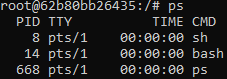
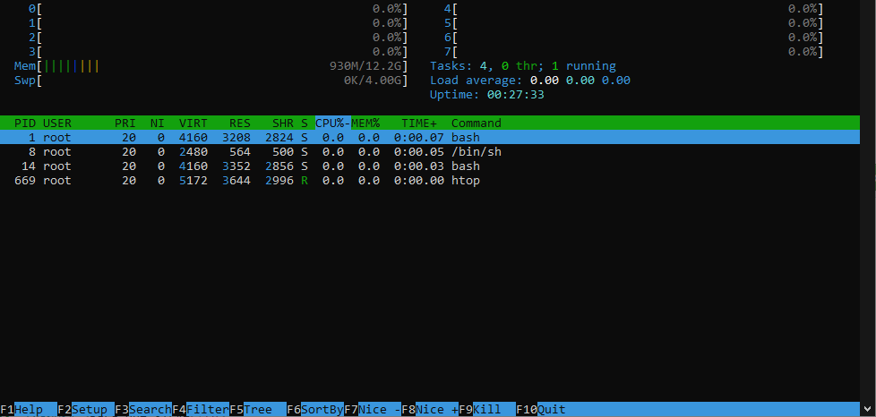

# ¿Qué son los PIDs y para que sirven?
Este apartado está dedicado a conocer y saber gestionar los procesos en un sistema Unix de forma MUY MUY superficial.

Cuando se crea un nuevo proceso en un sistema Unix se le **relaciona a un ID** (**id**entifier). **Para** diferenciarlo y **gestionar** los **procesos** corriendo en el sistema, llamado PID (**p**rocess **ID**).
A parte del PID, el proceso también tiene:
  - PPID (**P**arent **PID**). Es el PID del proceso que lo ha creado (llamado *proceso padre o madre*).\*
  - TTY (**T**ele **TY**pewriter). Es el ID de la terminal donde se lanzó el proceso.\*\*
  - UID (**U**ser **ID**). Es el ID del usuario que lanzó el proceso.
> NOTA:
>
> \*El primer proceso que ejecuta Linux se llama `systemd` (su PID es el 0). Todos los demás procesos se generan como hijos de `systemd`.
>
> \*\*Cuando a un proceso le falta el TTY es llamado *daemon*. Proceso que está ejecutándose en segundo plano que no posee una terminal que lo controle.

## Comandos útiles
Para **visualizar**los yo recomiendo:
| ps                 | htop                       |
| ------------------ | -------------------------- |
| Para cosas simples | Más amigable e interactivo |
|  |  |

Y para forzar el **parar** un proceso en concreto se puede usar `kill`, aunque obviamente no es la forma más ortodoxa de hacerlo.
```shell
# Puedes usar el PID del proceso
$ sudo kill 668
# o puedes terminar con todos los procesos con un mismo nombre
$ sudo killall ps
```
Ten en cuenta que cuando un proceso acaba, deja libre el PID que estaba utilizando para que otro proceso lo pueda usar. Y es posible que cuando vuelva a ejecutarse ese proceso tenga un PID diferente.

> NOTA: En linux es una buena práctica usar el comando `service` para la gestión de los procesos. Por ejemplo `killall <nombre del proceso>` = `service <nombre del proceso> stop`.

## Archivos PID
Son una forma de hacer saber a los demás procesos cuál es su PID actual.

Debido a que en cada ejecución un proceso puede tener diferentes PIDs, los archivos PID son creados por el proceso escribiendo en su interior su PID actual. Después el resto de los procesos pueden leer ese archivo y relacionas el proceso y el PID.

> Normalmente estos archivos se encuentran en `/var/run/`.
