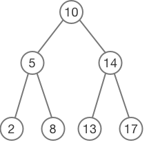

# Push_swap : Porque Swap_push no suena tan natural
***Oficialmente terminado el xx/12/2022 / Nota xxx de 100 / [English](README.md) version***

En este proyecto se aprenderá a ordenar datos en un stack, con un conjunto limitado de instrucciones, y utilizando el menor número de instrucciones posibles. Para tener éxito, se deberá trastear con algunos de los diversos algoritmos y elegir, entre todos, el más apropiado para un ordenamiento óptimo.

## Índice
***TODO***

## Enunciado del ejercicio
Se dispone de 2 stack (llamados *a* y *b* ) y un grupo de números enteros aleatorios (en el grupo nunca habrá dos numeros iguales) de entrada que se deben ordenar.

Al **principio**, en el stack *a* estarán los números enteros y el stack *b* vacio.

El **objetivo** es ordenar los números en orden ascendeste (implementando un algoritmo de ordenación) en el stack *a*. Pero, para ello, solo se podrán usar las sigientes instrucciones:

| Instrucción            | Descripción                                                                                                          |
|------------------------|----------------------------------------------------------------------------------------------------------------------|
| `sa` (swap a)            | Intercambia los dos primeros elementos encima del stack a. No hace nada si hay uno o menos elementos.             |
| `sb` (swap b)            | Intercambia los dos primeros elementos encima del stack a. No hace nada si hay uno o menos elementos.             |
| `ss`                     | `sa` y `sb` a la vez.                                                                                                    |
| `pa` (push a)            | Toma el primer elemento del stack b y lo pone encima del stack a. No hace nada si b está vacío.                   |
| `pb` (push b)            | Toma el primer elemento del stack a y lo pone encima del stack b. No hace nada si b está vacío.                   |
| `ra` (rotate a)          | Desplaza hacia arriba todos los elementos del stack a una posición. El primer elemento se convierte en el último. |
| `rb` (rotate b)          | Desplaza hacia arriba todos los elementos del stack a una posición. El primer elemento se convierte en el último. |
| `rr`                     | `ra` y `rb` a la vez.                                                                                                    |
| `rra` (reverse rotate a) | Desplaza hacia abajo todos los elementos del stack a una posición. El último elemento se convierte en el primero. |
| `rrb` (reverse rotate b) | Desplaza hacia abajo todos los elementos del stack a una posición. El último elemento se convierte en el primero. |
| `rrr`                    | `rra` y `rrb` a la vez.                                                                                                  |

## Conceptos básicos a interiorizar en esta práctica
Los algoritmos de ordenación, son muy utilies para aprender temas clave de la informatica como la notación *Big-O*, método *divide-and-conquer* y estructuras de datos (como son árboles binarios, heaps, listas enlazadas, etc) entre otras cosas.

### Algoritmos de ordenación
Un algoritmo de ordenación sirve para reorganizar una matriz o lista de elementos dada de acuerdo con un operador de comparación en los elementos. El operador de comparación se utiliza para decidir el nuevo orden de los elementos de la estructura de datos (por ejemplo, orden ascendente o descendente).

#### Estabilidad
>NOTA: Aunque en esta práctica, no al no haber números repetidos, saber lo que significa la estabilidad en los algoritmos de ordenación no tenga sentido siempre esta bien saber algo más.

Un algoritmo de ordenación **es estable si conserva el orden original de los elementos con valores clave iguales** (donde la clave es el valor por el que ordena el algoritmo). Por ejemplo:

Cuando las cartas se clasifican por valor con una clasificación estable, los dos 5 deben permanecer en el mismo orden en la salida clasificada en la que estaban originalmente. Cuando se clasifican con una clasificación no estable, los 5 pueden terminar en el orden opuesto.

#### Naturalidad
Un algoritmo de ordenación se dice que **es natural cuando su tiempo de ejecución mejora considerablemente si los datos de entrada están ordenados o casi ordenados**.

### Notación Big-O
**IMPORTANTE:** La notación Big O es una notación que se usa cuando se habla de tasas de crecimiento. **No dice la velocidad de ejecución de un algoritmo** (ya que hay muchas variables como la CPU en la que se ejecuta o el lenguaje en el que está escrito), si no que **formaliza la noción entre dos funciones** que "crecen al mismo ritmo", o que una función "crece más rápido que la otra", y cosas por el estilo. **Ya que muestra el total de operaciones (para el peor caso) que se van a hacer**.

Para ignorar las diferencias en la implementación, se utiliza su **tasa de crecimiento asintótica**. Dado un consumo de recursos de *f*, encontramos una función simple *g* tal que *f=Θ(g)*. Donde *Θ* equivale a diferentes implementaciones, por lo que hay que ver que valor toma *g* (por ejemplo, tiempo lineal *g(n)=n*, tiempo cuadrático *g(n)=n2*, etc.). Es importante recalcar que esto no altera el comportamiento de *g* diferentes tamaños de entrada, duplicar el valor de entrada dará como resultado el mismo comportamiento en *g* (doblándolo para *g(n)=n*, cuatriplicándolo para *g(n)=n2*, y así sucesivamente). Así desde el punto de vista del análisis de algoritmos, no se pierde información por simplificar *f* en *g*, ya que ambos tienen el mismo comportamiento. Esto permite comparar diferentes algoritmos según sus tasas de crecimiento y afirmar que un algoritmo es "más rápido" que otro. Por ejemplo, si hay dos algoritmos con consumos de recursos *f1*, *f2*, con valores *f1=Θ(g1)*, *f2=Θ(g2)*, entonces el primer algoritmo es más rápido que el segundo si *g1=o(g2)*.

#### Notación Bachmann–Landau
| Ecuación | Nombre       | Significado                                                         |
|----------|--------------|---------------------------------------------------------------------|
| f = O(g) | big-oh       | Si eventualmente *f* crece más lento que algún múltiplo de *g*      |
| f = o(g) | little-oh    | Si eventualmente *f* crece más lento que cualquier múltiplo de *g*  |
| f = Ω(g) | big-omega    | Si eventualmente *f* crece más rápido que algún múltiplo de *g*     |
| f = ω(g) | little-omega | Si eventualmente *f* crece más rápido que cualquier múltiplo de *g* |
| f = Θ(g) | theta        | Si finalmente *f* crece al mismo ritmo que *g *                     |

#### Las tasas de crecimiento más comunes (de más rápida a más lenta)
| Ecuación | Descripción | Ejemplo |
|---|---|---|
| O(1) | El algoritmo de tiempo constante se ejecuta en un tiempo constante sin importar cuán grande sea la entrada | Programas que ignoran su entrada y calculan la respuesta a un problema específico |
| O(log log n) | Orden sublogarítmica |  |
| O(log n) | El algoritmo de tiempo logarítmico se ejecuta en un tiempo proporcional al logaritmo de la entrada | Binary search |
| O(√n) | Orden sublineal |  |
| O(n) | El algoritmo de tiempo lineal se ejecuta en un tiempo proporcional a la entrada | Simple search |
| O(n * log n) | Un algoritmo de tiempo lineal rítmico se ejecuta en un tiempo que no se distingue particularmente del tiempo lineal para una entrada "razonable" | Quicksort |
| O(n^2) | Los algoritmos de tiempo cuadrático toman un tiempo proporcional al cuadrado de la entrada | Selection sort |
| O(n^3) | Un algoritmo de tiempo cúbico probablemente tendrá la estructura de un ciclo a través de *n* valores dentro de otro ciclo de *n* valores dentro de un tercer ciclo de *n* valores |  |
| O(n^c) | Orden potencial fija |  |
| O(a^n), n > 1 | Para un algoritmo de tiempo exponencial, aumentar la entrada en uno es suficiente para multiplicar el tiempo de ejecución del algoritmo (por a). Tenga en cuenta que si a < b, entonces a^n=o(b^n) | Resolver la fórmula booleana de *n* variables. Para probar cada posibilidad requiere que se verifiquen *2^n* casos |
| O(n!) | Algoritmos que verifican cada permutación de una matriz, en la que hay n! de ellos | Traveling salesperson |
| O(n^n) | Orden potencial exponencial |  |

### Método *Divide and Conquer*
Divide y vencerás es una forma de afrontar problemas complejos **dividirendo** problemas complejos en problemas más pequeños que son más fáciles de **conquistar** (resolver) y luego **combinar** las respuestas para resolver el problema original. Algoritmos de ordenación como mergesort, quicksort siguen esta forma de pensar

Divide y vencerás tiene un paso recursivo, en el que se resuelven los subproblemas, y un caso base, que es el punto en el que el problema no se puede desglosar más.

>Existe una variación de divide y vencerás donde el problema se reduce a un subproblema, llamada *Decrease and Conquer*

### Binary Search Trees
Los árboles de búsqueda binarios son estructuras de datos simples. Como dice el nombre, funciona con la idea de dos valores. Inicialmente, tenemos un nodo raíz que almacena algún valor, digamos X. En el siguiente nivel, tenemos dos ramas. La rama izquierda conduce a los nodos que representan todos los valores menores que x, mientras que la rama derecha conduce a los nodos que representan todos los valores mayores que x. La división del árbol en varias ramas sigue ocurriendo según la condición binaria y obtenemos un árbol binario. Los datos organizados utilizando esta estructura de datos permiten operaciones de búsqueda eficientes.

### Binary Heap
El Heap es un árbol binario completo, la raíz de cualquier árbol es mayor o igual (o menor o igual) que todos sus hijos (propiedad del heap).

La distinción fundamental con el árbol de búsqueda binaria es que el heap permite números duplicados y que sus datos no se ordenan.

### Listas link-adas *vs* Array de enteros
Teniendo en cuenta las cualidades que tienen las listas pudiendo aumentarse y reducirse en el tiempo de ejecución debido a su **organización dinámica** realizada al asignar y no asignar memoria. Esto hace que **no** sea **necesario preasignar memoria** a la hora de definirla. A diferencia de un array que sí se necesita saber sus dimensiones desde el inicio.

Además, las listas vinculadas se pueden **reorganizar** sin necesidad de realojar el array entero en cada movimiento, ya que solo hay que **cambiar la dirección del puntero al siguiente nodo** de la lista.

Por el contrario, en una lista no se pueden implementar un Binary search y la búsqueda de datos es más engorrosa ya que a un array con pasar la posición del dato es suficiente.

#### Problema con la largura del array de enteros
Si la matriz es una variable global, estática o automática (`int matriz[10];`), entonces funciona `sizeof(array)/sizeof(array[0])`.

Si es una matriz asignada dinámicamente (`int* matriz = malloc(sizeof(int)*10);`) o se pasa como un argumento de función (`void f(int matriz[])`), entonces no puede encontrar su tamaño en tiempo de ejecución. Por lo que se tiene que guardar en algún lugar.

>NOTA: `sizeof(array)/sizeof(array[0])` se compila perfectamente incluso para el segundo caso, pero producirá un resultado erroneo.

### Algoritmos probados
>NOTA:
>Algunos algoritmos dan comportamientos diferentes cuando se les da una entrada diferente. Por ellos para análisis de algoritmos se suelen buscar los siguientes tiempos de ejecución, dadas diferentes entradas de un tamaño específico:
>  - **El peor de los casos**. Es el tiempo más largo para una entrada específica
>  - **El caso promedio**. Es el tiempo promedio para todas las entradas.
>  - A veces también se analiza **el mejor tiempo de ejecución del caso**.

## Paso que yo he seguido para hacer el ejercicio
  1. Hacer una correcta gestion de los valores de entrada.
     - Detectar si la sintasis de los valores de entrada es la correcta
     - Pasar los números de cadena de caracteres a `int` + Detectar valores erroneos
     - Detectar si hay números repetidos

## Referencias
  - https://www.geeksforgeeks.org/sorting-algorithms/
  - https://brilliant.org/wiki/sorting-algorithms/
  - https://www.freecodecamp.org/news/sorting-algorithms-explained-with-examples-in-python-java-and-c/
  - https://www.freecodecamp.org/news/big-o-notation-explained-with-examples/
  - https://sbme-tutorials.github.io/2018/data-structures/data-structures.html
  - https://www.educba.com/linked-list-advantages/

  - https://github.com/LeoFu9487/push_swap_tester

  - https://pinetools.com/es/generador-numeros-aleatorios
  - https://www.calculatorsoup.com/calculators/statistics/random-number-generator.php

  - https://stackoverflow.com/questions/1444406/how-to-delete-duplicate-lines-in-a-file-without-sorting-it-in-unix
