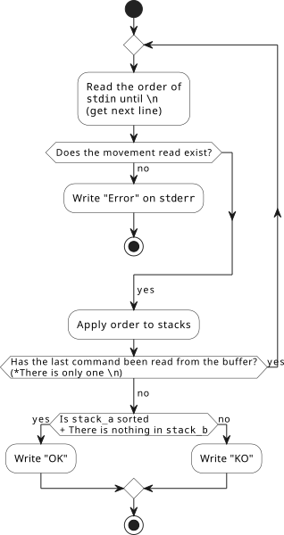

# Push_swap : Because Swap_push isn’t as natural
***Officially finished at 2023-09-20 / Grade: 125 of 100 / Versión en [español](LEEME.md)***

In this project you will learn to sort data on a stack, with a limited set of instructions, using the lowest possible number of actions. To be successful, you will have to manipulate various types of algorithms and choose the most appropriate solution (out of many) for an optimized data sorting.

## Table of Contents
- [Push\_swap : Because Swap\_push isn’t as natural](#push_swap--because-swap_push-isnt-as-natural)
  - [Table of Contents](#table-of-contents)
  - [Exercise statement](#exercise-statement)
  - [Basic concepts to be internalized in this practice](#basic-concepts-to-be-internalized-in-this-practice)
    - [Sorting algorithms](#sorting-algorithms)
      - [Stability](#stability)
      - [Naturalness](#naturalness)
    - [Big-O notation](#big-o-notation)
      - [Bachmann–Landau notation](#bachmannlandau-notation)
      - [The most common growth rates (from fastest to slowest)](#the-most-common-growth-rates-from-fastest-to-slowest)
    - [Linked Lists *vs* Integer Arrays](#linked-lists-vs-integer-arrays)
      - [The problem with length of integer array](#the-problem-with-length-of-integer-array)
    - [Implemented algorithm: INSERTION SORT](#implemented-algorithm-insertion-sort)
      - [Performance](#performance)
  - [Steps I followed to do the exercise](#steps-i-followed-to-do-the-exercise)
  - [Bonus: Make your own *checker*](#bonus-make-your-own-checker)
  - [References](#references)

## Exercise statement
There are 2 stacks (called *a* and *b* ) and a group of random integers (in the group there will never be two equal numbers) to be sorted.

At the **beginning**, in the stack *a* will be the integers and the stack *b* empty.

The **objective** is to sort the numbers in ascending order (by implementing a sorting algorithm) in the stack *a*. But, for this, only the following instructions can be used:

| Instrucción            | Descripción                                                                                         |
|------------------------|-----------------------------------------------------------------------------------------------------|
| `sa` (swap a)          | Swap the first 2 elements at the top of stack a. Do nothing if there is only one or no elements. |
| `sb` (swap b)          | Swap the first 2 elements at the top of stack a. Do nothing if there is only one or no elements. |
| `ss`                   | `sa` and `sb` at the same time.                                                                   |
| `pa` (push a)          | Take the first element at the top of b and put it at the top of a. Do nothing if b is empty.   |
| `pb` (push b)          | Take the first element at the top of a and put it at the top of b. Do nothing if a is empty.   |
| `ra` (rotate a)        | Shift up all elements of stack a by 1. The first element becomes the last one.                 |
| `rb` (rotate b)        | Shift up all elements of stack b by 1. The first element becomes the last one.                 |
| `rr`                   | `ra` and `rb` at the same time.                                                                   |
| `rra` (reverse rotate a) | Shift down all elements of stack a by 1. The last element becomes the first one.             |
| `rrb` (reverse rotate b) | Shift down all elements of stack b by 1. The last element becomes the first one.             |
| `rrr`                  | `rra` and `rrb` at the same time.                                                                 |

The way the sorting algorithm is evaluated will depend on the total movements it executes for different numbers:
  - For 3 input values: No more than 3 moves are allowed.
  - For 5 input values: No more than 12 moves are allowed.
  - For 100 input values: Scored from 1 to 5 depending on the number of moves executed.
    - 5 points. Performed moves <= 700
    - 4 points. 700 < movements <= 900
    - 3 points. 900 < movements <= 1100
    - 2 points. 1100 < movements <= 1300
    - 1 point. 1300 < movements <= 1500
  - For 500 input values: Scored from 1 to 5 depending on the number of moves executed.
    - 5 points. Performed movements <= 5500
    - 4 points. 5500 < movements <= 7000
    - 3 points. 7000 < movements <= 8500
    - 2 points. 8500 < movements <= 10000
    - 1 point. 10000 < movements <= 11500

## Basic concepts to be internalized in this practice
Sorting algorithms are very useful for learning key computer science topics such as *Big-O* notation, *divide-and-conquer* method and data structures (such as binary trees, heaps, linked lists, etc) among other things.

### Sorting algorithms
A sorting algorithm serves to rearrange a given array or list of elements according to a comparison operator on the elements. The comparison operator is used to decide the new order of the elements in the data structure (e.g. ascending or descending order).

#### Stability
>NOTE: Although in this practice, since there are no repeated numbers, knowing what stability means in sorting algorithms is meaningless, it is always good to know something more.

A sorting algorithm **is stable if it preserves the original order of elements with equal key values** (where the key is the value by which the algorithm sorts). For example:

When the cards are sorted by value with a stable rank, the two 5's must remain in the same order in the sorted output they were originally in. When sorted with a non-stable ranking, the 5's may end up in the opposite order.

#### Naturalness
A sorting algorithm is said to **be natural when its execution time is significantly improved if the input data is sorted or nearly sorted**.

### Big-O notation
**IMPORTANT:** Big-O notation is a notation used when talking about growth rates. **It does not tell the execution speed of an algorithm** (since there are many variables such as the CPU it runs on or the language it is written), but rather **formalizes the notion between two functions** that "grow at the same rate", or that function "grows faster than the other", and things like that. **It shows the total number of operations (for the worst case) will be done**.

To ignore implementation differences, their **asymptotic growth rate** is used. Given a resource consumption of *f*, we find a simple function *g* such that *f=Θ(g)*. Where *Θ* are different implementations, so you have to see what value *g* takes (for example, linear time *g(n)=n*, quadratic time *g(n)=n2*...) . It is important to note that this does not alter the behavior of *g* different input sizes, doubling the input value will result in the same behavior on *g* (doubling it for *g(n)=n*, quadrupling it for *g( n)=n2*, and so on). Thus, from the point of view of algorithm analysis, no information is lost by simplifying *f* to *g*, since both have the same behavior. This allows you to compare different algorithms based on their growth rates and claim that one algorithm is "faster" than another. For example, if there are two algorithms with resource consumption *f1*, *f2*, with values *f1=Θ(g1)*, *f2=Θ(g2)*, then the first algorithm is faster than the second if *g1=o(g2)*.

#### Bachmann–Landau notation
| Equation | Name         | Meaning                                              |
|----------|--------------|------------------------------------------------------|
| f = O(g) | big-oh       | if eventually f grows slower than some multiple of g |
| f = o(g) | little-oh    | if eventually f grows slower than any multiple of g  |
| f = Ω(g) | big-omega    | if eventually f grows faster than some multiple of g |
| f = ω(g) | little-omega | if eventually f grows faster than any multiple of g  |
| f = Θ(g) | theta        | if eventually f grows at the same rate as g          |

#### The most common growth rates (from fastest to slowest)
| Equation | Description | Example |
|---|---|---|
| O(1) | Constant-time algorithm runs in a constant time no matter how large the input is | Programs that ignore their input and compute the answer to a specific problem are also constant-time, even though this problem might take a very long time |
| O(log log n) | Orden sublogarítmica | if eventually f grows slower than any multiple of g |
| O(log n) | Logarithmic-time algorithm runs in time proportional to the logarithm of the input | Binary search |
| O(√n) | Orden sublineal | if eventually f grows faster than any multiple of g |
| O(n) | Linear-time algorithm runs in time proportional to the input | Simple search |
| O(n * log n) | Often encountered in sorting algorithms, a linearithmic-time algorithm runs in time that's not particularly distinguishable from linear-time for "reasonable" input | Quicksort, Merge Sort, Heap Sort, Tree sort |
| O(n^2) | Quadratic-time algorithms take time proportional to the square of the input | Selection sort, Insertion sort, Bubble sort |
| O(n^3) | A cubic-time algorithm will likely have the structure of a loop through n values inside another loop of n values inside a third loop of n values |  |
| O(n^c) | orden potencial fija |  |
| O(a^n), n > 1 | For an exponential-time algorithm, increasing the input by one is enough to multiply the algorithm's running time (by a). Note that if a < b, then a^n=o(b^n) | Boolean formula on *n* variables can be satisfied; trying each possibility requires *2^n* cases to be checked |
| O(n!) | Algorithms which check every permutation of an array, in which there are n! of them | Traveling salesperson |
| O(n^n) | Orden potencial exponencial |  |

### Linked Lists *vs* Integer Arrays
Taking into account the qualities that lists have, they can be increased and decreased at runtime due to their **dynamic organization** performed by allocating and not allocating memory. This makes it **not** necessary to preallocate memory** when defining it. Unlike an array that does need to know its dimensions from the beginning.

Also, linked lists can be **rearranged** without having to relocate the entire array on each move, since you just have to **change the pointer's address to the next node** in the list.

On the other hand, a Binary search cannot be implemented in a list and the data search is more cumbersome since passing the position of the data is enough for an array.

#### The problem with length of integer array
If the array is a global, static, or automatic variable (`int array[10];`), then `sizeof(array)/sizeof(array[0])` works.

If it is a dynamically allocated array (`int* array = malloc(sizeof(int)*10);`) or passed as a function argument (`void f(int array[])`), then it cannot find its runtime size. So it has to be stored somewhere.

>NOTE: `sizeof(array)/sizeof(array[0])` compiles perfectly even for the second case, but will produce a wrong result.

### Implemented algorithm: INSERTION SORT
I have used this sorting algorithm as it seemed the most intuitive and easy to implement. The basic idea is to split the input values into 2 lists, the unordered input list (stack_a) and the ordered one (stack_b). In this practice, the ordered list will be inversely ordered, so that when they are passed back to the stack_a, the values remain ordered.

**The values of the unordered list are selected one by one and placed in their correct position in the ordered list.** In the example below, the numbers with the black box would be the ordered list and those without a box would be the unordered list:

In order for this to be done in the most efficient way possible, in each new iteration the cost of moving each value to its correct position in the ordered list must be calculated and moving the one that involves the least cost.

#### Performance
>NOTE:
>Some algorithms give different behaviors when given different input. Therefore, for algorithm analysis, the following execution times are usually sought, given different inputs of a specific size:
> - **Worst case scenario**. It is the longest time for a specific input
> - **The average case**. It is the average time for all inputs.
> - Sometimes **best case execution time** is also analyzed.

## Steps I followed to do the exercise
   1. Make a correct management of input values.
      - Detect if the syntax of input values is correct
      - Detect when a number is so big that it doesn't fit in an `int`
      - Pass numbers from string to `int` + Catch erroneous values
      - Detect if there are repeated numbers
   2. Define the structure that the list will have (if you are going to use arrays, you are a smoker of life and if you are going to use the lists you made for libft you already mix drugs with alcohol)
   3. Make the auxiliary functions to manage the structure (`lstnew`, `lstadd`, `lstlast`...)
   4. Do the functions of all the movement rules (`sa`, `pb`, `ra`...)
   5. Make a first sorting algorithm **super simple** to see that everything is ok
   6. (Optional, but **VERY** recommended) Implement some kind of visualizer either yours or a third party like [visualizer](https://github.com/o-reo/push_swap_visualizer/tree/75c535c5d44e984dcb7d7f48bc9a144beb5e66ae)
   7. Implement the sorting algorithm you want
   8. Compare the result with the given *checker*.

PS: Here is a [web](https://www.calculatorsoup.com/calculators/statistics/random-number-generator.php) for the generation of random numbers.

## Bonus: Make your own *checker*
I have faced this section in 2 stages:
   1. I had to modify my makefile to be able to compile the `push_swap` binary on the one hand and the `checker` binary on the other
   2. Based on the `main` function of the `push_swap` I have changed the logic of `sort` for the checks that the statement requests following this flow:

## References
  - https://www.geeksforgeeks.org/sorting-algorithms/
  - https://brilliant.org/wiki/sorting-algorithms/
  - https://www.freecodecamp.org/news/sorting-algorithms-explained-with-examples-in-python-java-and-c/
  - https://www.freecodecamp.org/news/big-o-notation-explained-with-examples/
  - https://sbme-tutorials.github.io/2018/data-structures/data-structures.html
  - https://www.educba.com/linked-list-advantages/

---
Made by daampuru | LinkedIn: [David Ampurua](https://www.linkedin.com/in/david-ampurua)
