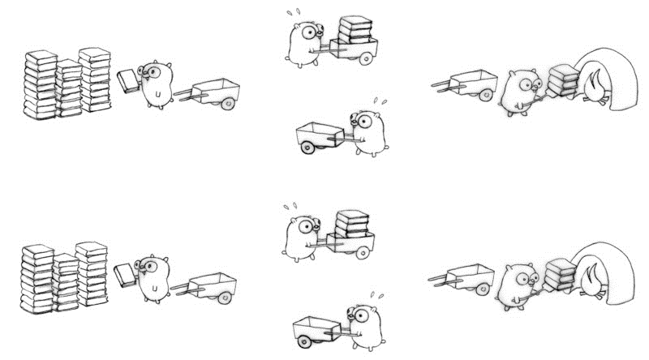

# Philosophers
***Oficialmente terminado el xx/06/2023 / Nota xxx de 100 / [English](README.md) version***

En este proyecto, aprenderás los principios básicos de *hilar* un proceso. Vas a aprender a como crear hilos y descubrirás los mutex.

## Índice
***TODO***

## Enunciado del ejercicio
### Contexto
  - En una mesa redonda con un bol de spaghetti en medio
  - Los comensales son 1 o más filósofos sentados alrededor de la mesa
  - Hay un tenedor por cada filosofo
  - Al ser necesarios 2 tenedores para comer los espaguetis correctamente, los filósofos utilizaran su tenedor de la derecha e izquierda para comer
  - Los filósofos pueden ir cambiando entre sus 3 estados:
    - Comiendo
    - Pensando
    - Durmiendo
  - Cuando un filósofo termina de comer, empieza a dormir. Cuando termina de dormir, empieza a pensar hasta poder empezar a comer de nuevo
  - El programa termina cuando uno de los filósofos muere de hambre
  - Los filósofos no se pueden comunicarse entre ellos

### Reglas generales
  - **No** se pueden utilizar **variables globales**
  - El programa tiene los siguientes **argumentos de entrada**
    - El *número de filósofos* (y de tenedores). Mínimo tiene que haber un filósofo
    - El *tiempo que tarda en comer* un filósofo (en milisegundos). Durante este tiempo el filósofo estará utilizando 2 tenedores
    - El *tiempo* que puede estar un filósofo *sin comer antes de morir* (en milisegundos). La cuenta atrás empieza desde el inicio de su última comida (o desde el inicio del programa, cuando todavía no ha comido por primera vez)
    - El *tiempo que está durmiendo* un filósofo (en milisegundos)
    - \[Opcional\] El número mínimo de veces que tienen que comer para que termine el programa. Si no está definido el programa termina con la muerte de un filósofo
  - El **filósofo** número **1** se **sienta junto al último filósofo**. Cualquier otro filósofo número N se sienta entre el filósofo número N - 1 y el filósofo número N + 1
  - No puedes tener más de **10ms entre la muerte de un filósofo y el momento en el que imprimes su muerte**.

### logs
  - El programa debe mostrar los siguientes logs durante su ejecución:
    - \<timestamp_in_ms\> \<philosopher number\> has taken a fork
    - \<timestamp_in_ms\> \<philosopher number\> is eating
    - \<timestamp_in_ms\> \<philosopher number\> is sleeping
    - \<timestamp_in_ms\> \<philosopher number\> is thinking
    - \<timestamp_in_ms\> \<philosopher number\> died
  - Los mensajes no pueden mezclarse entre ellos a la hora de mostrarlos en la terminal
  - Un mensaje que anuncie la muerte de un filósofo no debe mostrarse más de 10 ms después de la muerte del filósofo
  - Se debe evitar que los filósofos mueran

### Reglas del programa Obligatorio
  - Cada filósofo debe ser un **hilo** (*thread*, en inglés)
  - Hay un tenedor entre cada par de filósofos. Por lo tanto, si hay varios filósofos, cada filósofo tiene un tenedor en su lado izquierdo y un tenedor en su lado derecho. Si solo hay un filósofo, solo debería haber un tenedor en la mesa.
  - Para evitar que los filósofos "dupliquen" los tenedores, se debe proteger el estado de cada uno de los tenedores con un `mutex`.

### Reglas del programa Bonus
  - Cada filósofo debe ser un **proceso**. Pero el proceso principal no debe ser un filósofo.
  - Todos los tenedores están en medio de la mesa
  - No tienen estados en la memoria, pero el número de tenedores disponibles está representado por un **semáforo**


## Conceptos básicos a interiorizar en esta práctica: ¿Qué es la programación *multithread*?
El objetivo de este apartado teórico es poder entender conceptos relacionados con el paradigma de [**programación concurrente**](https://es.wikipedia.org/wiki/Computaci%C3%B3n_concurrente) (no confundir con [Computación paralela](https://es.wikipedia.org/wiki/Computaci%C3%B3n_paralela)) como son los **threads**, la **concurrencia**, los **objetos protegidos**, etc.

Multithreading es una técnica que permite la ejecución concurrente (por etapas) y/o paralela (simultánea) de dos o más partes de un programa con el objetivo de maximizar la utilización de una CPU.

### Programas, procesos y hilos
Los programas están formados por procesos e hilos.
   - Un **programa** es un **archivo ejecutable**
   - Un **proceso** es una **instancia de un programa en ejecución**
   - **Thread** (también llamado hilo o subproceso) es la **unidad ejecutable más pequeña de un proceso**. Un proceso puede tener múltiples subprocesos con un subproceso principal

<div align="center">

</div>

Los **procesos** están **aislados entre ellos** y **no interrumpen la ejecución de los demás** procesos. Linux los identifica mediante el PID (como ya se vio en la práctica [pipex](../../lvl2/pipex/LEEME.md)).

Teniendo en cuenta que muchos procesos se están ejecutando a la vez en un PC, estos deben compartir la CPU. **El proceso de cambiar entre dos procesos en ejecución en la CPU se denomina cambio de contexto** de proceso. **El cambio de contexto de proceso es costoso** porque el núcleo tiene que guardar registros antiguos y cargar registros actuales, mapas de memoria y otros recursos.

<table>
<thead>
  <tr>
    <th>Característica</th>
    <th>Proceso</th>
    <th>Thread</th>
  </tr>
</thead>
<tbody>
  <tr>
    <td>Costos de creación y finalización</td>
    <td>Un proceso, también llamado “heavyweight”, cada vez que se crea hace falta generar su respectivo espacio de memoria.<br>En caso de que la creación se haga desde otro proceso este será duplicado.</td>
    <td>Un hilo, a veces es llamado LWP (<i><b>L</b>ight<b>w</b>eight <b>P</b>rocess</i>), debido a que la mayor parte de los costos de almacenamiento los hereda del proceso padre (dependiendo del OS) y no hace falta rehacerlo para el hilo.</td>
  </tr>
  <tr>
    <td>Tiempo de creación y finalización   </td>
    <td>Se tarda más en crear y eliminar</td>
    <td>Arda menos en crearse y finalizarse</td>
  </tr>
  <tr>
    <td>Memoria</td>
    <td>Esta aislada del resto de procesos</td>
    <td>Todos los hilos generados por un mismo padre comparten memoria (el heap y static).<br>Pero tienen su propio stack.<br>*Que es cada parte de memoria se ha aprendido en el
<a href="(../../lvl1/get_next_line/LEEME.md)">gnl</a></td>
  </tr>
  <tr>
    <td>Cambios de contesto</td>
    <td>Son más lentos</td>
    <td>Son más rápidos</td>
  </tr>
  <tr>
    <td>Comunicación</td>
    <td>La comunicación entre procesos requiere de IPC (<i><b>I</b>nter-<b>P</b>rocess <b>C</b>ommunication</i> e.g.: pipes, redirections, and sockets)</td>
    <td>No necesitan mecanismos extra. Se utiliza su memoria compartida</td>
  </tr>
  <tr>
    <td>Tratamiento por el OS</td>
    <td>Cada proceso es gestionado de forma independiente</td>
    <td>Todos los hilos del mismo nivel son tratados como una sola tarea por el OS</td>
  </tr>
  <tr>
    <td>Estabilidad</td>
    <td>Mayor que los hilos porque se ejecutan en espacios de memoria separados</td>
    <td>Si uno falla, puede afectar potencialmente a otros hilos que se ejecutan dentro del mismo   proceso.</td>
  </tr>
  <tr>
    <td>Posibilidad de crear hilos</td>
    <td>Un proceso puede contener varios hilos</td>
    <td>Un hilo no puede contener otros hilos</td>
  </tr>
</tbody>
</table>

<div align="center">

</div>

#### Estados de un thread
Los estados de un thread y un hilo son bastante parecidos y pueden varias dependiendo de la plataforma donde se esté ejecutando. El esquema de abajo es un diagrama de estados genérico.

<div align="center">

</div>

#### Existen 2 niveles de implementación de threads: nivel usuario y nivel kernel
<table>
<thead>
  <tr>
    <th>Nivel usuario</th>
    <th>Nivel kernel</th>
  </tr>
</thead>
<tbody>
  <tr>
    <td>Son implementados por los usuarios, el SO no reconoce los threads de nivel de usuario. Los maneja como si fueran procesos de un solo hilo. Generalmente son pequeños y rápidos que los thread a nivel de kernel. No hay participación del kernel en la sincronización de thread a nivel de usuario. Si un subproceso de nivel de usuario realiza una operación de bloqueo, se bloqueará todo el proceso.</td>
    <td>Son gestionados directamente por el SO, la información de contexto para el proceso (así como sus threads) son administrados por el kernel. Esto hace que los thread a nivel de kernel sean más lentos que los threads a nivel de usuario. Si un subproceso del kernel realiza una operación de bloqueo, otro subproceso aún puede continuar con la ejecución.</td>
  </tr>
</tbody>
</table>

#### ¿Programación concurrente VS paralela?
Un programa es **concurrente** si puede soportar dos o más acciones **en progreso** (alternándolas). Maneja varias tareas al mismo tiempo, define acciones que **pueden** ser ejecutadas al mismo tiempo.

> La concurrencia puede ser entre procesos o entre thread, ya que son los hilos quienes permiten concurrencia dentro de un proceso.

Mientras que, un programa es **paralelo** si puede soportar dos o más acciones **ejecutándose simultáneamente**. No solo debe ser concurrente, sino que también debe estar diseñado para correr en un medio con hardware paralelo (GPU's, procesadores multi-core, etc).

<div align="center">

</div>

> Otra opción que en vez de tener una CPU con diferentes cores, directamente tener más de una CPU y tener un multiproceso[^1].

En la imagen de abajo se utiliza un ejemplo más apegado a la realidad cotidiana:

<div align="center">

</div>

Otra forma de verlo es pensar que la concurrencia es la propiedad de un programa, mientras que el paralelismo es la forma en la que se ejecuta un programa concurrente.

##### Ejemplo paso a paso
Imagina que tenemos una persona (equivalente a un thread) que tiene que llevar una pila de libros a un incinerador. Para llevar los libros al incinerador usa una carretilla y luego vuelve a la pila de libros para volver a llenar la carretilla.

<div align="center">

</div>

Si se añade otra persona al ejemplo esta no podrá hacer nada porque las herramientas estarán ocupadas por su compañero.

<div align="center">

</div>

Para poder hacer que la nueva persona tenga algo que hacer y aporte hay 2 opciones; una concurrente y la otra paralela.

La **solución concurrente** es añadir otra carretilla, sin embargo, esto ocasiona que se necesite una sincronización entre las personas porque si las dos llegan al incinerador al mismo tiempo una tendrá que esperar a la otra, provocando una pérdida de efectividad.

<div align="center">

</div>

La **solución paralela** es duplicar los recursos, usando dos pilas de libros, dos carretillas y dos incineradores. Esto hace que no se necesite gestionar la sincronización entre las personas y que ambos puedan trabajar todo el tiempo.

<div align="center">

</div>

Para complicar el ejemplo ahora vamos a usar 4 personas (en este caso los hilos pasan a ser *corrutinas*[^2]). Usando una solución concurrente podemos gestionar a las personas para que hagan tareas diferentes y completamente independientes:
  - Persona 1: Lena la carretilla con libros
  - Persona 2: Lleva la carretilla al incinerador
  - Persona 3: Arroja los libros de la carretilla al incinerador
  - Persona 4: Devuelve la carretilla a la pila de libros

<div align="center">

</div>

Además de esto, una solución concurrente puede ser fácilmente paralelizable, lo único que se necesita es duplicar todo y que todo se haga simultáneamente.

<div align="center">

</div>

#### Multithreading: Ventajas y desventajas
La principal ventaja del multithreading es tener la capacidad de hacer programas concurrentes y más ligeros, pero que no están aislados entre ellos. A diferencia del multiproceso (ver en la práctica [pipex](../../lvl2/pipex/LEEME.md), la función `fork()`) el cual puede ser concurrente pero manteniendo el aislamiento que proporciona el trabajar con procesos.

El que los thread no tengan aislamiento entre ellos, porque comparte parte de su memoria, hace que sea más fácil comunicarlos, pero a su vez si se gestiona mal la memoria o los recursos que comparten pueden darse las siguientes desventajas:
- [Condición de carrera](./annex/theory/raceCondition.es.md) (o violación de la exclusión mutua). Cuando los thread acceden a la vez a un recurso compartido
- [Deadlock](./annex/theory/deadlock.es.md) (o Interbloqueo). Cuando dos thread tienen un recurso bloqueado e intentar usar en del otro
- Starvation (Lockout o Aplazamiento indefinido en castellano). Ocurre cuando un thread hace que los recursos compartidos no estén disponibles durante largos períodos de tiempo, lo que genera un desperdicio de recursos.

> Un concepto relacionado, son las *Thread safe functions*. Se trata de funciones que funcionan correctamente durante la ejecución simultánea por varios threads (un ejemplo de esto es el bonus del [gnl](../../lvl1/get_next_line/LEEME.md)).

#### Métodos de sincronización y comunicación
Una de las formas para evitar las desventajas comentadas en el apartado anterior, es la correcta comunicación entre thread para que estén correctamente sincronizados entre ellos. El acceso de los thread a la sección crítica del código se controla mediante el uso de técnicas de sincronización.

Entre todas las formas que existen aquí se van a comentar 2; La exclusión mutua (*mutex*, de **Mut**ual **ex**clusion) y los semáforos.

> Es verdad que los mutex y los semáforos tienen algunas similitudes en su implementación, pero resuelven problemas diferentes.

  - **Semáforo**. Es un mecanismo de señalización, una variable de tipo *unsigned integer* que se comparte entre varios subprocesos. De este modo se pueden avisar de eventos en tiempo de ejecución entre ellos.
  - **Mutex**. Es un tipo específico de semáforo binario que se utiliza para proporcionar un **mecanismo de bloqueo**. Se usa principalmente para evitar las [condiciones de carrera](./annex/theory/raceCondition.es.md) proporcionado exclusión mutua a recursos compartidos.


### Implementación de hilos en sistemas POSIX: pthread
Para implementar thread en los sistemas POSIX en C, hay que incluir la API específica para esto llamada *pthread*.

>La inclusión de esta librería tiene 2 partes por un lado el incluir su header en el código `#include pthread` y por el otro la utilización del flag de compilación `-pthread`.

Las funciones que se usan en esta práctica son:
<table>
<thead>
  <tr>
    <th>Utilidad</th>
    <th>Función</th>
    <th>Descripción</th>
  </tr>
</thead>
<tbody>
  <tr>
    <td rowspan="3">Genstión de threads</td>
    <td>thread_create</td>
    <td>Inicia un nuevo thread en el proceso de llamada</td>
  </tr>
  <tr>
    <td>pthread_join</td>
    <td>La función espera a que el thread especificado por el thread termine</td>
  </tr>
  <tr>
    <td>thread_detach</td>
    <td>El thread pasado a la función pasa a estar <i>detached</i>, por lo no hay necesidad de esperarle una vez termina.<br>
    *NOTA: Intentar <i>detach</i> un thread ya desconectado da como resultado un comportamiento incierto</td>
  </tr>
  <tr>
    <td rowspan="4">Gestión de los mutex<br>(Para la parte obligatoria)</td>
    <td>pthread_mutex_init</td>
    <td>Inicializa un objeto mutex</td>
  </tr>
  <tr>
    <td>pthread_mutex_destroy</td>
    <td>Destruye un objeto mutex</td>
  <tr>
    <td>pthread_mutex_lock</td>
    <td>Bloquea el objeto mutex.<br>
    Si el mutex ya está bloqueado, el thread de llamada se bloqueará hasta que el mutex esté disponible.</td>
  </tr>
  <tr>
    <td>pthread_mutex_unlock</td>
    <td>Libera el objeto mutex.<br>
    Si hay threads bloqueados en el objeto mutex, el planificador determinará qué threads será el siguiente en usar el mutex</td>
  </tr>
  <tr>
    <td rowspan="5">Gestión de los semáforos<br>(Para el bonus)<br></td>
    <td>sem_open</td>
    <td>Inicia y abre un semáforo <i>named</i>, devolviendo un puntero de semáforo</td>
  </tr>
  <tr>
    <td>sem_close</td>
    <td>Cierra el puntero de semáforo <i>named</i> dado.<br>
    Esto también se hace cuando un proceso ternima. Pero el semáforo aún permanece en el sistema[^3].</td>
  </tr>
  <tr>
    <td>sem_post</td>
    <td>Publica en un semáforo, incrementando su valor en uno.<br>
    *NOTA: Si el valor resultante es mayor que cero y hay un thread esperando en el semáforo, el thread en espera disminuye el valor del semáforo en uno y continúa ejecutándose.</td>
  </tr>
  <tr>
    <td>sem_wait</td>
    <td>Decrementa en uno el valor del semáforo.<br>
    *NOTA: El semáforo se decrementará cuando su valor sea mayor a cero. Si el valor del semáforo es cero, el thread actual se bloqueará hasta que el valor del semáforo sea mayor que cero.</td>
  </tr>
  <tr>
    <td>sem_unlink</td>
    <td>El semaforo se eliminará del sistema solo cuando su valor de llegue a 0 (es decir, después de que todos los procesos que lo tienen abierto, llamen a sem_close o se cierren).<br>
    </td>
  </tr>
</tbody>
</table>

> La Principal diferencia entre semáfores *unmaned* y *named* radica en que los *unnamed* solo se pueden usar en procesos que estén relacionados ya sea porque uno es hijo de otro o porqué comparten memoria ([más info](https://stackoverflow.com/questions/13145885/name-and-unnamed-semaphore)).

Ejemplo simple de un programa con 2 thread y un recurso compartido protegido mediante un mutex (La ejecución en muuuuuy lenta debido a los cambios de contexto de los thread) :
```c
#include <stdio.h>
#include <stdint.h>
#include <pthread.h>

#define BIG 1000000000UL
uint32_t count = 0;
pthread_mutex_t lock = PTHREAD_MUTEX_INITIALIZER;

void *count_to_big(void *arg) {
	for (uint32_t i=0; i < BIG; i++) {
		pthread_mutex_lock(&lock); // Thread will wait here until it can get the lock
		count++;
		pthread_mutex_unlock(&lock); // Other thread releases lock here
	}
	return (NULL);
}

int main() {
	pthread_t t;
	pthread_create(&t, NULL, count_to_big, NULL);
	count_to_big(NULL);
	pthread_join(t, NULL);
	printf("Result -> Count = %u\n", count);
}
```

Ejemplo de un programa con 2 thread con 2 segundos de diferencia. El primer thread estará dormido durante 4 segundos por lo que el segundo thread empezará 4 – 2 = 2 segundos después de ser llamado.

```c
#include <stdio.h>
#include <pthread.h>
#include <semaphore.h>
#include <fcntl.h>
#include <unistd.h>

sem_t *semaphore;
int value = 100;

void *thread(void *name)
{
	//wait
	sem_wait(semaphore);
	sem_getvalue(semaphore, &value);
	printf("Input %s value of the semaphore = %i\n", name, value);

	//critical section
	sleep(4);

	//signal
	sem_post(semaphore);
	sem_getvalue(semaphore, &value);
	printf("Output %s value of the semaphore = %i\n", name, value);
}


int main()
{
	char name[] = "/test_semaphore"; // The name should begin with a '/' character
	pthread_t t1, t2;

	semaphore = sem_open(name, O_CREAT, S_IRUSR | S_IWUSR, 1); // Init and open a named semaphore with initial value 1
	sem_getvalue(semaphore, &value);
	printf("The initial value of the semaphore = %i\n", value);
	pthread_create(&t1, NULL, thread, "THREAD 1");
	sleep(2);
	pthread_create(&t2, NULL, thread, "THREAD 2");
	pthread_join(t1, NULL);
	pthread_join(t2, NULL);
	if (sem_close(semaphore) < 0)
		perror("Error closing semaphore");
	else
		printf("Semaphore successfully closed\n");
	if (sem_unlink(name) < 0)
		perror("Error unlinking semaphore");
	else
		printf("Semaphore successfully unlinked\n");
	return 0;
}
```
output
```bash
The initial value of the semaphore = 1
Input THREAD 1 value of the semaphore = 0
Output THREAD 1 value of the semaphore = 1
Input THREAD 2 value of the semaphore = 0
Output THREAD 2 value of the semaphore = 1
Semaphore successfully closed
Semaphore successfully unlinked
```

> Prueba a aumentar el valor inicial del semáforo a 1 a 2 o mayor, esto hará que los 2 thread puedan usar el recurso he inicie justo cuando el creado y no al de X segundos.
>
> Otra prueba que puedes hacer es quitar la función `sem_unlink()` y ver como al hacer `sem_close()` y cambiar el valor inicial en `sem_open()` este no cambia ya que el semáforo sigue activo a nivel de kernel.

### La función `gettimeofday()`
```c
Propotipo:
int gettimeofday(struct timeval *restrict tv,
	struct timezone *_Nullable restrict tz)
```
Para obtener tiempo, se lee en el formato de la estructura:
```c
	struct timeval {
	time_t		tv_sec;		// seconds
	suseconds_t	tv_usec;	// microseconds
	};
```
Ejemplo:
```c
/* Get the actual time value in miliseconds */
unsigned int	get_msec(void)
{
	struct timeval	time;

	gettimeofday(&time, NULL);
	return (time.tv_sec * 1000 + time.tv_usec / 1000);
}
```

### La función `sleep()`


### Explicar como funciona el tester que he hecho


Cosas a comentar
- piensa bien como vas a crear y repartir los tenedores en tu estructura del filosofo
- piensa cual va ha ser la estrategia para avisar a los demás filosofos (threads) de que uno a muerto y hay que para la ejecucion
- Utiliza el flag `fsanitize=thread` para detectar los finales de carrera
- Para poder detertar leaks con valgrind utiliza muertes cortas de los filosofos


## Referencias
  - https://ferestrepoca.github.io/paradigmas-de-programacion/progconcurrente/concurrente_teoria/index.html#historia
  - https://stackoverflow.com/questions/1050222/what-is-the-difference-between-concurrency-and-parallelism
  - https://start-concurrent.github.io/
  - https://www.techtarget.com/whatis/definition/multithreading
  - https://www.educative.io/blog/multithreading-and-concurrency-fundamentals
  - https://medium.com/@sukrita.ki/processes-and-threads-8b20ca6d6b50
  - https://www.baeldung.com/linux/process-vs-thread
  - https://stackoverflow.com/questions/57160637/difference-between-kernel-kernel-thread-and-user-thread
  - https://www.geeksforgeeks.org/difference-between-user-level-thread-and-kernel-level-thread/
  - https://learn.microsoft.com/en-us/archive/blogs/ericlippert/what-is-this-thing-you-call-thread-safe
  - https://www.geeksforgeeks.org/mutex-lock-for-linux-thread-synchronization/
  - https://blog.feabhas.com/2009/09/mutex-vs-semaphores-%E2%80%93-part-1-semaphores/
  - https://blog.feabhas.com/2009/09/mutex-vs-semaphores-%E2%80%93-part-2-the-mutex/
  - https://blog.feabhas.com/2009/10/mutex-vs-semaphores-%E2%80%93-part-3-final-part-mutual-exclusion-problems/
  - https://stackoverflow.com/questions/13145885/name-and-unnamed-semaphore
  - https://www.ibm.com/docs/en/i/7.3?topic=ssw_ibm_i_73/apis/ipcsemo.htm
  - https://blog.bearcats.nl/accurate-sleep-function/
  - https://blog.bearcats.nl/perfect-sleep-function/
  - [[Youtube video list] Programming with Threads](https://www.youtube.com/playlist?list=PL9IEJIKnBJjFZxuqyJ9JqVYmuFZHr7CFM)

## Annex: Tools for debug
  - [philosophers-visualizer](https://nafuka11.github.io/philosophers-visualizer/)

[^1] Multiproceso: Técnica en la cual se hace uso de 2 o más CPUs del PC para ejecutar uno o varios procesos.

[^2] Corrutina: Componente de programación concurrente que permite la ejecución cooperativa de múltiples tareas en un mismo hilo de ejecución. En los hilos tradicionales el SO es responsable de la planificación y la asignación del tiempo de ejecución, en cambio las corrutinas son controladas por el programador y pueden ceder el control de manera explícita.

[^3] Los semáforos POSIX son persistentes en el Kernel, no como los de windows.

---
Hecho por daampuru | LinkedIn: [David Ampurua](https://www.linkedin.com/in/david-ampurua)
