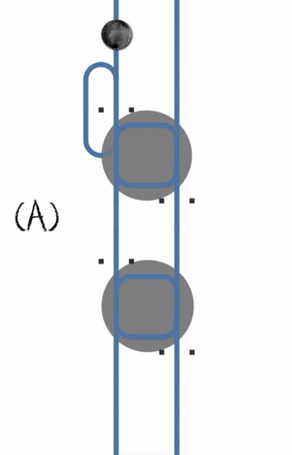

# Interbloqueo (Deadlock)

Un interbloqueo ocurre cuando dos subprocesos bloquean cada uno una variable diferente al mismo tiempo y luego intentan bloquear la variable que el otro subproceso ya bloqueó. Como resultado, cada subproceso deja de ejecutarse y espera a que el otro subproceso libere la variable. Debido a que cada subproceso contiene la variable que desea el otro subproceso, no ocurre nada y los subprocesos permanecen bloqueados.

En el gif de abajo, 2 procesos compiten por 2 recursos en orden opuesto. Estos son los diferentes casos que se pueden dar:
   - **(A)** Pasa un solo proceso
   - **(B)** El proceso posterior tiene que esperar
   - **(C)** Se produce un interbloqueo cuando el primer proceso bloquea el primer recurso al mismo tiempo que el segundo proceso bloquea el segundo recurso
   - **(D)** El interbloqueo se puede resolver cancelando y reiniciando el primer proceso.

