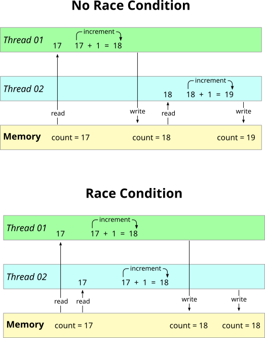

# Condición de carrera

Una condición de carrera es un comportamiento que ocurre cuando dos threads acceden a una variable compartida al mismo tiempo.

Se denomina condición de carrera debido a la analogía entre dos threads que compiten para llegar primero al recurso.

La consecuencia más común de una condición de carrera son los valores impredecibles de las variables que se comparten entre varios threads. Esto resulta de la imprevisibilidad del orden en que se ejecutan los subprocesos. En algún momento gana un hilo y en algún momento gana el otro hilo. En otras ocasiones, la ejecución funciona correctamente. Además, si cada hilo se ejecuta por separado, el valor de la variable se comporta correctamente.

Ejemplo en C:
<table>
<thead>
  <tr>
    <th>Código sin subprocesos</th>
    <th>Código con condición de carrera</th>
    <th>Código sin condición de carrera</th>
  </tr>
</thead>
<tbody>
  <tr>
    <td><pre lang="c">
#include &ltstdio.h&gt
#include &ltstdint.h&gt

#define BIG 1000000000UL
uint32_t count = 0;

void count_to_big(void) {
	for (uint32_t i=0; i < BIG; i++)
		count++;
}

int main() {
	count_to_big();
	count_to_big();
	printf("Result -> Count = %u\n", count);
}</pre></td>
    <td><pre lang="c">
#include &ltstdio.h&gt
#include &ltstdint.h&gt
#include &ltpthread.h&gt

#define BIG 1000000000UL
uint32_t count = 0;

void * count_to_big(void *arg) {
	for (uint32_t i=0; i < BIG; i++)
		count++;
	return (NULL);
}

int main() {
	pthread_t t;
	pthread_create(&t, NULL, count_to_big, NULL);
	count_to_big(NULL);
	pthread_join(t, NULL);
	printf("Result -> Count = %u\n", count);
}</pre>
    </td>
    <td><pre lang="c">
#include &ltstdio.h&gt
#include &ltstdint.h&gt
#include &ltpthread.h&gt

#define BIG 1000000000UL
uint32_t count = 0;
pthread_mutex_t lock = PTHREAD_MUTEX_INITIALIZER;

void * count_to_big(void *arg) {
	for (uint32_t i=0; i < BIG; i++) {
		pthread_mutex_lock(&lock); // Thread will wait here until it can get the lock
		count++;
		pthread_mutex_unlock(&lock); // Other thread releases lock here
	}
	return (NULL);
}

int main() {
	pthread_t t;
	pthread_create(&t, NULL, count_to_big, NULL);
	count_to_big(NULL);
	pthread_join(t, NULL);
	printf("Result -> Count = %u\n", count);
}
</pre>
    </td>
  </tr>
  <tr>
    <td>Output: 
    <pre>Result -> Count = 2000000000</pre>
    </td>
    <td>Output: 
    <pre>Result -> Count = 1?????????</pre>
    *Debido a las condiciones de la carrera, el número final varía.</td>
    <td>Output: 
    <pre>Result -> Count = 2000000000</pre>
    *En este ejemplo específico, el uso de subprocesos múltiples no tiene mucho sentido ya que la ejecución del programa lleva mucho tiempo debido al cambio de contexto entre subprocesos. Es solo un ejemplo simple para demostrar las condiciones de carrera.</td>
  </tr>
</tbody>
</table>
